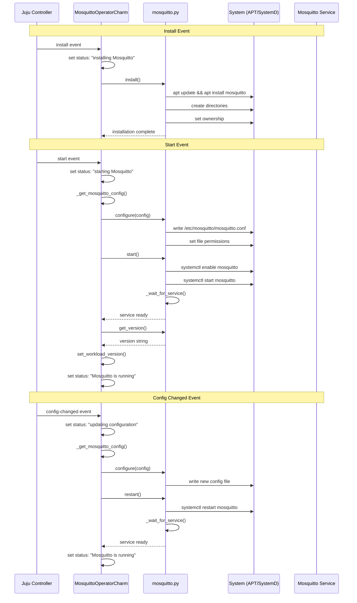
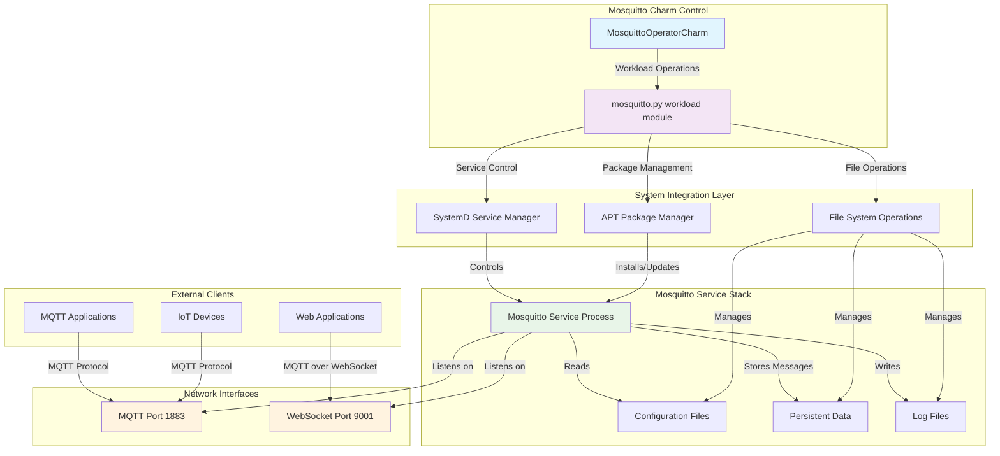
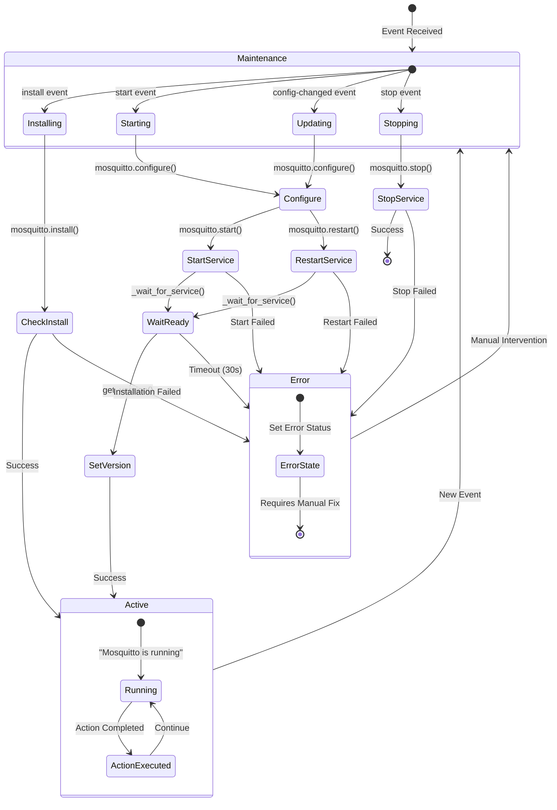
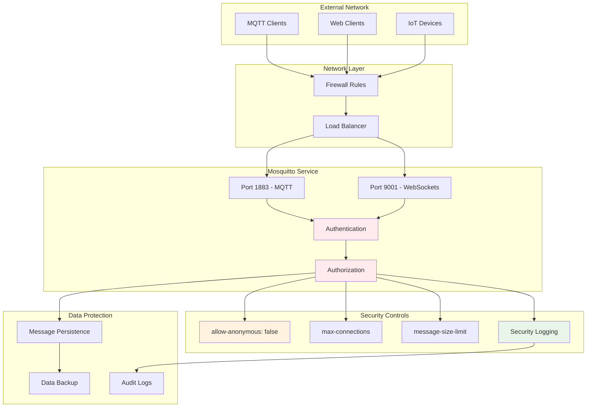

# Mosquitto Charm Architecture Diagrams

This document provides visual diagrams explaining the Mosquitto charm architecture, event flows, and component interactions.

## Overall Charm Architecture

```mermaid
graph TB
    subgraph "Juju Controller"
        J[Juju Agent]
    end
    
    subgraph "Mosquitto Charm Unit"
        subgraph "Charm Process"
            C[MosquittoOperatorCharm]
            CFG[MosquittoConfig]
            ACTIONS[Action Classes]
        end
        
        subgraph "Workload Module"
            M[mosquitto.py]
            INSTALL[install()]
            CONFIGURE[configure()]
            START[start()]
            STOP[stop()]
            STATUS[get_status()]
        end
    end
    
    subgraph "System Services"
        APT[APT Package Manager]
        SYSTEMD[SystemD]
        MOSQUITTO[Mosquitto Service]
    end
    
    subgraph "File System"
        CONFIG[/etc/mosquitto/mosquitto.conf]
        DATA[/var/lib/mosquitto/]
        LOGS[/var/log/mosquitto/]
    end
    
    J -->|Hook Events| C
    C -->|Configuration| CFG
    C -->|Workload Operations| M
    M -->|Package Management| APT
    M -->|Service Control| SYSTEMD
    SYSTEMD -->|Manages| MOSQUITTO
    M -->|Writes Config| CONFIG
    MOSQUITTO -->|Reads Config| CONFIG
    MOSQUITTO -->|Stores Data| DATA
    MOSQUITTO -->|Writes Logs| LOGS
    
    style C fill:#e1f5fe
    style M fill:#f3e5f5
    style MOSQUITTO fill:#e8f5e8
```

## Charm Event Lifecycle



## Configuration Flow

```mermaid
graph LR
    subgraph "Juju Config"
        P[port: 1883]
        WP[websockets-port: 9001]
        MC[max-connections: -1]
        AA[allow-anonymous: false]
        LL[log-level: notice]
        PERS[persistence: true]
        MSL[message-size-limit: 268435456]
    end
    
    subgraph "Charm Processing"
        GC[_get_mosquitto_config()]
        DC[MosquittoConfig dataclass]
    end
    
    subgraph "Workload Module"
        CONF[configure()]
        GEN[_generate_config()]
    end
    
    subgraph "Mosquitto Config File"
        CF["/etc/mosquitto/mosquitto.conf"]
        PORT["port 1883"]
        LOG["log_dest file /var/log/mosquitto/mosquitto.log"]
        LOGTYPE["log_type notice"]
        PERSIST["persistence true"]
        LISTENER["listener 9001\nprotocol websockets"]
    end
    
    P --> GC
    WP --> GC
    MC --> GC
    AA --> GC
    LL --> GC
    PERS --> GC
    MSL --> GC
    
    GC --> DC
    DC --> CONF
    CONF --> GEN
    GEN --> CF
    
    CF --> PORT
    CF --> LOG
    CF --> LOGTYPE
    CF --> PERSIST
    CF --> LISTENER
    
    style DC fill:#e1f5fe
    style CF fill:#e8f5e8
```

## Action Execution Flow

```mermaid
graph TD
    subgraph "Juju User"
        U[User runs: juju run mosquitto-operator/0 restart]
    end
    
    subgraph "Juju Controller"
        J[Juju Agent]
    end
    
    subgraph "Charm Process"
        C[MosquittoOperatorCharm]
        AE[_on_restart_action()]
        ASE[_on_get_status_action()]
    end
    
    subgraph "Workload Module"
        R[restart()]
        GS[get_status()]
    end
    
    subgraph "System"
        SYS[systemctl restart mosquitto]
        WAIT[_wait_for_service()]
        STATUS[systemctl status checks]
    end
    
    U -->|Action Request| J
    J -->|restart_action event| C
    C --> AE
    AE --> R
    R --> SYS
    R --> WAIT
    WAIT -->|Service Ready| AE
    AE -->|set_results()| C
    C -->|Action Results| J
    J -->|Response| U
    
    U -->|Status Request| J
    J -->|get_status_action event| C
    C --> ASE
    ASE --> GS
    GS --> STATUS
    STATUS -->|Status Dict| ASE
    ASE -->|set_results()| C
    
    style AE fill:#fff3e0
    style ASE fill:#fff3e0
    style R fill:#f3e5f5
    style GS fill:#f3e5f5
```

## Service Management Architecture



## Error Handling and Status Flow



## Data Flow and Persistence

```mermaid
graph LR
    subgraph "Configuration Sources"
        JC[Juju Config]
        DEFAULTS[Charm Defaults]
    end
    
    subgraph "Configuration Processing"
        MC[MosquittoConfig]
        GEN[_generate_config()]
    end
    
    subgraph "File System"
        CONF[/etc/mosquitto/mosquitto.conf]
        DATA[/var/lib/mosquitto/]
        LOGS[/var/log/mosquitto/]
    end
    
    subgraph "Mosquitto Service"
        PROC[Mosquitto Process]
        MEM[In-Memory State]
        PERSIST[Persistence Engine]
    end
    
    subgraph "External Interfaces"
        CLIENT[MQTT Clients]
        DISK[Persistent Storage]
        SYSLOG[System Logs]
    end
    
    JC --> MC
    DEFAULTS --> MC
    MC --> GEN
    GEN --> CONF
    
    CONF --> PROC
    PROC --> MEM
    PROC --> PERSIST
    PERSIST --> DATA
    PROC --> LOGS
    
    CLIENT <--> MEM
    DATA <--> DISK
    LOGS --> SYSLOG
    
    style MC fill:#e1f5fe
    style PROC fill:#e8f5e8
    style DATA fill:#fff3e0
```

## Testing Architecture

```mermaid
graph TB
    subgraph "Test Types"
        UT[Unit Tests]
        IT[Integration Tests]
    end
    
    subgraph "Unit Testing (ops.testing)"
        CTX[testing.Context]
        STATE[testing.State]
        RUN[ctx.run()]
        ASSERT[Assertions]
    end
    
    subgraph "Integration Testing (Jubilant)"
        TM[temp_model()]
        DEPLOY[juju.deploy()]
        CONFIG[juju.config()]
        ACTION[juju.run_action()]
        VERIFY[MQTT Client Tests]
    end
    
    subgraph "Test Coverage"
        EVENTS[Event Handlers]
        ACTIONS[Action Methods]
        WORKLOAD[mosquitto.py Functions]
        CONFIG_TESTS[Configuration Scenarios]
    end
    
    UT --> CTX
    CTX --> STATE
    STATE --> RUN
    RUN --> ASSERT
    
    IT --> TM
    TM --> DEPLOY
    DEPLOY --> CONFIG
    CONFIG --> ACTION
    ACTION --> VERIFY
    
    ASSERT --> EVENTS
    ASSERT --> ACTIONS
    VERIFY --> WORKLOAD
    VERIFY --> CONFIG_TESTS
    
    style UT fill:#e8f5e8
    style IT fill:#e1f5fe
    style VERIFY fill:#fff3e0
```

## Network and Security Model



These diagrams provide a comprehensive visual understanding of:

1. **Overall Architecture**: How components interact within the charm
2. **Event Lifecycle**: Step-by-step event processing flow
3. **Configuration Flow**: How Juju config becomes Mosquitto config
4. **Action Execution**: How user actions are processed
5. **Service Management**: Integration with system services
6. **Error Handling**: State transitions and error scenarios
7. **Data Flow**: Configuration and persistence patterns
8. **Testing Architecture**: Unit and integration test approaches
9. **Network Security**: Security controls and network topology

Each diagram uses consistent color coding:
- Light blue: Charm/Ops framework components
- Light purple: Workload/application logic
- Light green: External services/processes
- Light orange: Network interfaces/actions
- Light red: Security components