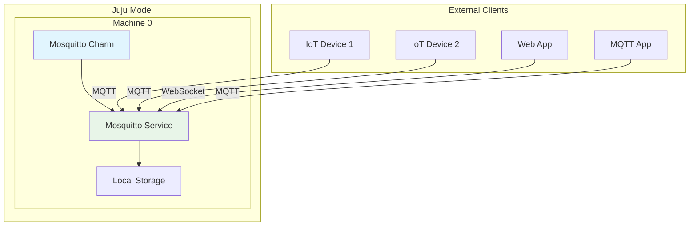
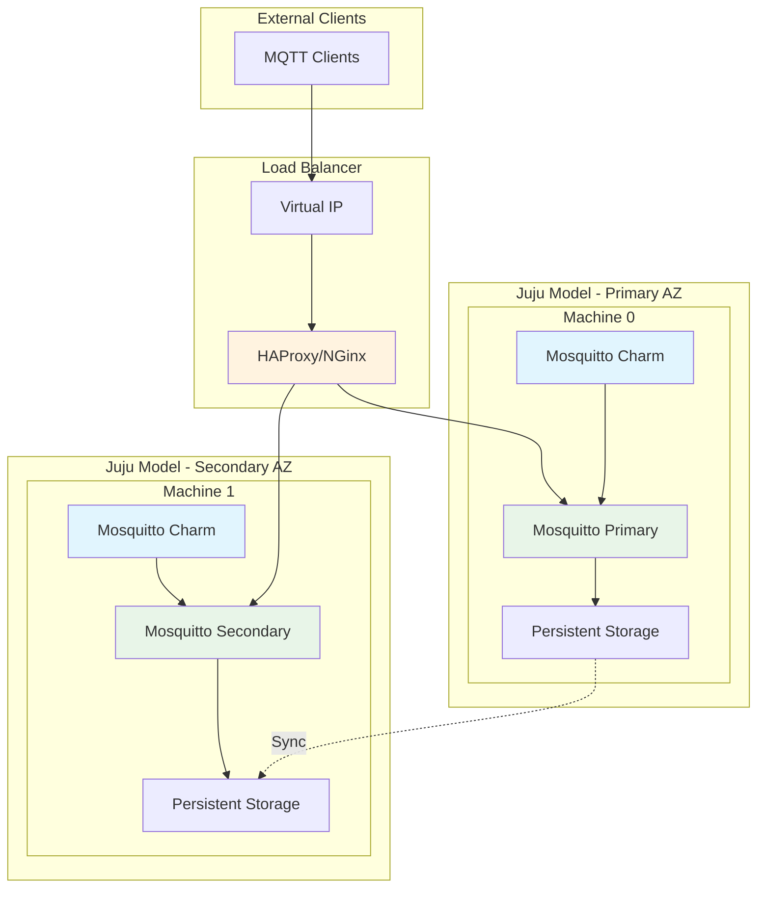
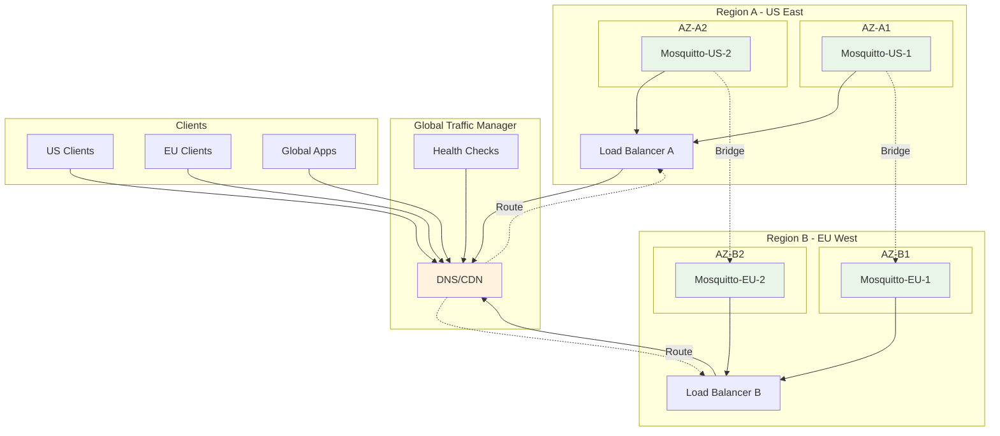
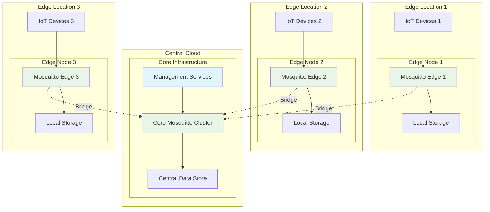
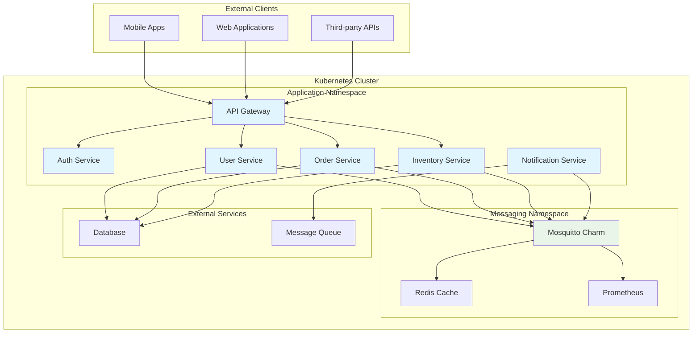
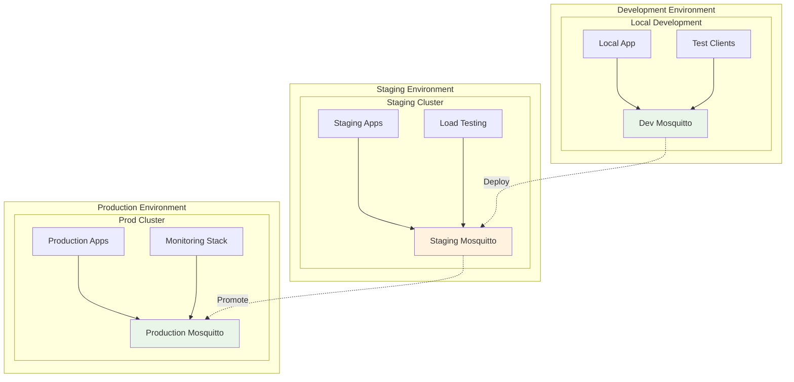
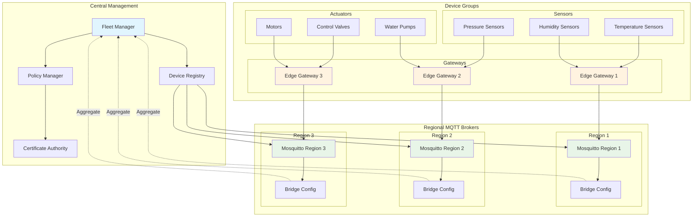
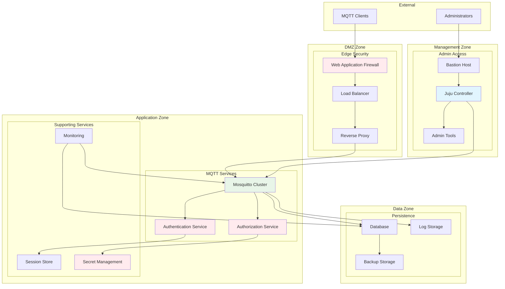
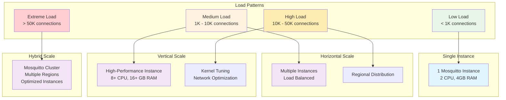

# Mosquitto Charm Deployment Patterns

This document illustrates common deployment patterns and scaling scenarios for the Mosquitto charm.

## Single Instance Deployment



```bash
# Deploy single instance
juju deploy mosquitto-operator
juju config mosquitto-operator \
  port=1883 \
  websockets-port=9001 \
  max-connections=1000
```

## High Availability Deployment



```bash
# Deploy HA setup
juju deploy mosquitto-operator mosquitto-primary \
  --to zone=primary
juju deploy mosquitto-operator mosquitto-secondary \
  --to zone=secondary

# Deploy load balancer
juju deploy haproxy
juju integrate mosquitto-primary haproxy
juju integrate mosquitto-secondary haproxy
```

## Multi-Region Deployment



## Edge Computing Deployment



```bash
# Deploy edge instances
juju deploy mosquitto-operator mosquitto-edge-1 \
  --constraints "mem=2G cores=1" \
  --to edge-location-1

juju deploy mosquitto-operator mosquitto-edge-2 \
  --constraints "mem=2G cores=1" \
  --to edge-location-2

# Configure for edge workloads
juju config mosquitto-edge-1 \
  max-connections=500 \
  persistence=true \
  message-size-limit=32768
```

## Microservices Integration Pattern



## Development and Testing Pattern



```bash
# Development setup
juju deploy mosquitto-operator --channel=edge
juju config mosquitto-operator \
  allow-anonymous=true \
  log-level=debug \
  max-connections=100

# Staging setup
juju deploy mosquitto-operator --channel=candidate
juju config mosquitto-operator \
  allow-anonymous=false \
  log-level=notice \
  max-connections=1000

# Production setup
juju deploy mosquitto-operator --channel=stable
juju config mosquitto-operator \
  allow-anonymous=false \
  log-level=warning \
  max-connections=10000 \
  persistence=true
```

## IoT Fleet Management Pattern



## Security Zones Pattern



## Performance Scaling Patterns



These deployment patterns provide guidance for:

1. **Single Instance**: Simple development and small-scale deployments
2. **High Availability**: Production deployments with redundancy
3. **Multi-Region**: Global scale with geographic distribution
4. **Edge Computing**: Distributed IoT and edge scenarios
5. **Microservices**: Integration within modern application architectures
6. **Development/Testing**: Proper environment separation
7. **IoT Fleet**: Large-scale device management
8. **Security Zones**: Defense-in-depth security architecture
9. **Performance Scaling**: Scaling strategies for different load patterns

Each pattern includes specific Juju commands and configuration examples to help implement the deployment approach.