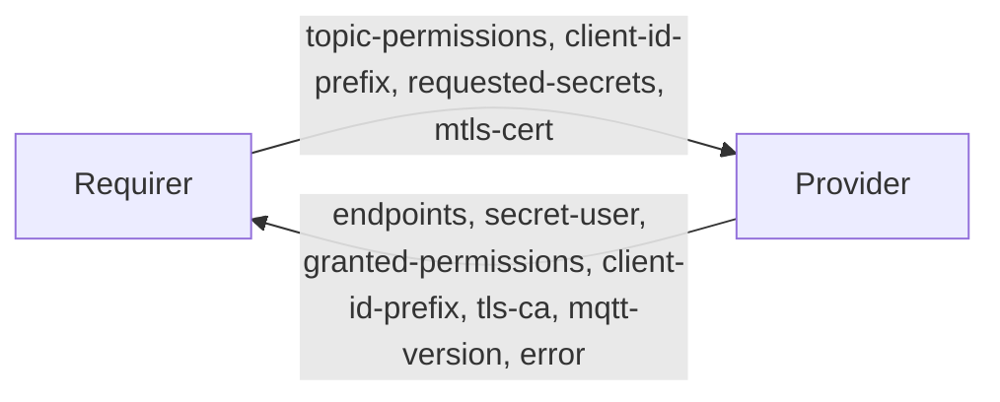

# `mqtt/v0`

## Usage

This relation interface describes the expected behaviour of any charm claiming to be
able to offer, or to consume, access to an [MQTT](https://mqtt.org/) broker.

The requirer asks for a set of topic filters and the access it wants on each of them.
The provider creates a broker user, installs the corresponding access control entries,
and publishes the listeners to connect to. The requirer then connects as an ordinary
MQTT client.

The vocabulary is Mosquitto's own: a permission is a `filter` plus an `access` of
`read`, `write`, `readwrite` or `deny`, which is exactly the grammar of a line in a
Mosquitto `acl_file` (`topic read|write|readwrite|deny <filter>`). A provider that is
not Mosquitto is expected to map that vocabulary onto whatever its own broker uses.

Credentials are **never** written to the relation databag. The provider creates an
application-owned Juju secret holding the username and password, grants it to the
relation, and publishes only the secret URI.

## Direction



As with all Juju relations, the `mqtt` interface consists of two parties: a Provider
(the broker) and a Requirer (an application that wants to publish or subscribe). Both
sides write to the **application** databag, so only the leader unit writes.

## Behaviour

Both the Requirer and the Provider need to adhere to the following criteria to be
considered compatible with this interface.

### Provider

- Is expected to create a broker user with a unique username and password when a
  requirer relates.
- Is expected to store those credentials in an **application-owned Juju secret**, to
  grant that secret to the relation, and to publish only the secret's URI as
  `secret-user`. It is expected never to write a password to a databag.
- Is expected to compare the secret's current content before calling `set_content`, so
  that reconciling unchanged credentials does not create a new secret revision on every
  hook, and does not send the requirer a spurious `secret-changed`.
- Is expected to handle `secret-remove` by calling `remove_revision`, so that revisions
  do not accumulate, and to tolerate the event arriving for a secret that no longer
  exists.
- Is expected to remove the user, and the secret, when the relation is removed.
- Is expected to publish `endpoints` with at least one reachable listener, computed from
  the charm's own network binding. It is expected **not** to read `private-address` from
  relation data: Juju 4.0 no longer maintains it.
- Is expected to publish `granted-permissions` reflecting the access control entries
  actually installed, which may be narrower than `topic-permissions`.
- Is expected to publish `tls-ca` whenever any published endpoint has `tls` set.
- Is expected to publish `error`, and not to publish credentials, when a request cannot
  be satisfied. It is expected to leave credentials it has already published in place,
  so that a later refused request does not disconnect a working client.
- Is expected to treat an unrecognised `access`, or a permission with no `filter`, as a
  permission it cannot grant, rather than erroring.

### Requirer

- May publish `topic-permissions`. A requirer that publishes none should expect to be
  granted nothing.
- Is expected to read credentials only from the Juju secret named by `secret-user`, and
  to re-read them on `secret-changed`.
- Is expected to tolerate `granted-permissions` being narrower than what it asked for,
  and to surface that in its own status rather than going into error.
- Is expected to tolerate an unknown enumeration value, treating it as `UNKNOWN`, and to
  tolerate fields it does not recognise.
- Is expected to connect with a client ID beginning with the `client-id-prefix` the
  provider published, when one was published.

### Both

- Are expected to parse an empty databag, and a databag in which any field is absent or
  `null`, without erroring.
- Are expected to emit collections in a stable order, and to ignore order and discard
  duplicates on reception.

## Relation data

[\[Pydantic schema\]](./schema.py)

### Provider

The provider writes to its **application** databag.

| Field | Type | Meaning |
|---|---|---|
| `endpoints` | `frozenset[Endpoint] \| None` | The listeners the requirer may connect to. |
| `secret-user` | `str \| None` | The URI of a Juju secret holding `{username, password}`. |
| `granted-permissions` | `frozenset[TopicPermission] \| None` | The access control entries actually installed. |
| `client-id-prefix` | `str \| None` | The MQTT client ID prefix reserved for the requirer. |
| `tls-ca` | `str \| None` | The CA chain that signs the broker's certificate, in PEM form. |
| `mqtt-version` | `str \| None` | The highest MQTT protocol version the broker supports. |
| `error` | `Error \| None` | Why the request could not be satisfied. |

`Endpoint` is `{host, port, tls, protocol}`; `protocol` is `mqtt`, `websockets` or
`UNKNOWN`. Encryption is carried by `tls`, not by the protocol, so there is no `mqtts`
or `wss` member: an encrypted WebSocket listener is `websockets` with `tls: true`.

`Error` is `{message, code}`, where `code` is one of `invalid-request`,
`permission-denied`, `broker-unavailable` or `UNKNOWN`.

#### `secret-user`

`secret-user` is an opaque Juju locator, not a network address. The `secret:` scheme is
required; no userinfo, host, port, query or fragment is allowed. The path is a Juju
secret ID: 20 lowercase alphanumeric characters. A secret shared from another model may
be spelled `secret://<model-uuid>/<id>`.

#### Example

```yaml
relation-info:
  - endpoint: mqtt
    related-endpoint: upstream
    application-data:
      endpoints: '[{"host": "10.1.2.3", "port": 1883, "tls": false, "protocol": "mqtt"},
                   {"host": "10.1.2.3", "port": 8883, "tls": true, "protocol": "mqtt"}]'
      secret-user: '"secret:cvh7kruupa1s46bqvuig"'
      granted-permissions: '[{"filter": "sensors/+/temperature", "access": "read"}]'
      client-id-prefix: '"telemetry-"'
      tls-ca: '"-----BEGIN CERTIFICATE-----\n..."'
      mqtt-version: '"5.0"'
      error: 'null'
```

The content of the secret named by `secret-user`:

```yaml
username: relation-7
password: a-32-character-random-string
```

Juju secret keys may not contain underscores, so a field whose Python name contains one
is written with hyphens and mapped back on the way out.

### Requirer

The requirer writes to its **application** databag.

| Field | Type | Meaning |
|---|---|---|
| `topic-permissions` | `frozenset[TopicPermission] \| None` | The filters and access the requirer wants. |
| `client-id-prefix` | `str \| None` | The MQTT client ID prefix the requirer wants reserved. |
| `requested-secrets` | `frozenset[SecretRequest] \| None` | The provider fields to deliver through a Juju secret. |
| `mtls-cert` | `str \| None` | The requirer's client certificate, when it authenticates with mutual TLS. |

`TopicPermission` is `{filter, access}`. `filter` is an MQTT topic filter, so `+`
matches one level and `#` matches the remainder; Mosquitto's `%u` and `%c`
substitutions are permitted. `access` is `read`, `write`, `readwrite`, `deny` or
`UNKNOWN`.

`username` and `password` are always delivered through a Juju secret, whether or not
they appear in `requested-secrets`.

#### Example

```yaml
relation-info:
  - endpoint: upstream
    related-endpoint: mqtt
    application-data:
      topic-permissions: '[{"filter": "commands/#", "access": "write"},
                           {"filter": "sensors/+/temperature", "access": "read"}]'
      client-id-prefix: '"telemetry-"'
      requested-secrets: '[{"field": "password"}, {"field": "username"}]'
      mtls-cert: 'null'
```

## Usage example

### Provider

```python
import ops

from charmlibs.interfaces import mqtt


class BrokerCharm(ops.CharmBase):
    def __init__(self, framework: ops.Framework):
        super().__init__(framework)
        self.mqtt = mqtt.MQTTProvider(self)
        framework.observe(self.mqtt.on.client_joined, self._reconcile)
        framework.observe(self.mqtt.on.client_departed, self._reconcile)

    def _reconcile(self, _: ops.EventBase) -> None:
        if not self.unit.is_leader():
            return
        binding = self.model.get_binding('mqtt')
        assert binding is not None
        host = str(binding.network.bind_address)
        for relation_id, request in self.mqtt.get_requests().items():
            username = f'relation-{relation_id}'
            granted = self._install_acls(username, request.topic_permissions)
            self.mqtt.publish_endpoints(
                request.relation,
                [mqtt.Endpoint(host=host, port=1883, protocol=mqtt.Protocol.MQTT)],
                mqtt_version='5.0',
            )
            self.mqtt.set_credentials(request.relation, username, self._password(username))
            self.mqtt.set_granted_permissions(request.relation, granted)
```

### Requirer

```python
import ops

from charmlibs.interfaces import mqtt


class ClientCharm(ops.CharmBase):
    def __init__(self, framework: ops.Framework):
        super().__init__(framework)
        self.mqtt = mqtt.MQTTRequirer(
            self,
            'broker',
            topic_permissions=[
                mqtt.TopicPermission(filter='sensors/#', access=mqtt.Access.READ),
            ],
            client_id_prefix='telemetry-',
        )
        framework.observe(self.mqtt.on.broker_available, self._on_broker_available)
        framework.observe(self.mqtt.on.broker_gone, self._on_broker_gone)

    def _on_broker_available(self, _: ops.EventBase) -> None:
        connection = self.mqtt.get_connection()
        if connection is None or connection.username is None:
            self.unit.status = ops.WaitingStatus('waiting for MQTT credentials')
            return
        if connection.error is not None:
            self.unit.status = ops.BlockedStatus(connection.error)
            return
        self._write_client_config(connection)
```

## Where this departs from `kafka_client`, and why

`kafka_client/v0` is the closest existing interface, and this one deliberately differs
from it in four places. `kafka_client` predates the current
[relation interface design rules](https://documentation.ubuntu.com/charmlibs/latest/how-to/design-relation-interfaces/),
and the rules are what changed, not the problem.

1. **Collections are sets of objects, not comma-separated strings.**
   `kafka_client` has `extra-user-roles: "consumer,producer"`. The rules say
   "collections of primitive types are strongly discouraged, because they are impossible
   to extend": there is nowhere to put a qualifier on one member. `topic-permissions`,
   `granted-permissions`, `endpoints` and `requested-secrets` are therefore arrays of
   objects, each of which can grow a field in a later minor version.

   `requested-secrets` is the one place this costs something: `data_platform_libs`
   spells it as a JSON list of strings, so a `data_platform_libs` requirer's
   `requested-secrets` will not parse as ours. That is deliberate — this is a new
   interface, not a `kafka_client` dialect, and it is better to be internally consistent
   than half-compatible with an interface we do not implement.

2. **Endpoints are structured.** `kafka_client` has
   `endpoints: "10.1.2.3:9092,10.1.2.4:9092"`. MQTT brokers commonly offer several
   listeners that differ in more than their port — plaintext, TLS, WebSockets — and the
   "semantic grouping" rule asks for `{host, port, tls, protocol}` rather than a string
   the recipient has to parse and then guess about.

3. **No top-level field is mandatory.** `kafka_client` requires `topic` on both sides.
   The rules say "top-level fields must not be mandatory. Any and all top-level fields
   may be absent in the relation data, and it must still parse cleanly", so that a peer
   from a different era, or a half-written databag, does not put the other side into
   error. Every field here is `X | None = None`.

4. **Every enumeration has an `UNKNOWN` member.** `kafka_client`'s `ExtraUserRole`
   validator raises `ValueError(f"Role {role} is not valid.")` on a value it does not
   know, which means a newer peer can put an older one into error simply by using a
   value added after it was packaged. Here an unrecognised value deserialises to
   `UNKNOWN`, and a member that carries only unknown information is discarded on
   reception.

One thing is kept from `kafka_client`, and from `data_platform_libs` more generally:
routing the credentials through a Juju secret and publishing only the URI, under the
`secret-user` name that `data_platform_libs`' `SECRET_GROUPS.USER` already uses.

`mqtt-version` is a single string rather than a set of versions, because a broker's
supported versions are a contiguous range and the highest one determines what a client
negotiates. Making it a scalar means it cannot later become a collection — field types
are fixed forever — so if per-version capability negotiation is ever needed it will have
to arrive as a new field.
