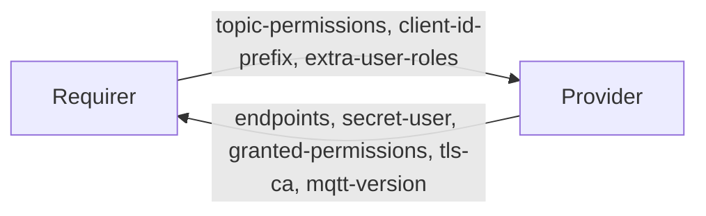

# Juju charm ecosystem research for a Mosquitto MQTT broker machine charm

Research date: **2026-09-15**. Target: Ubuntu 24.04 machine charm, Mosquitto installed from apt.

All code snippets below are copied verbatim from the sources cited; nothing here is invented.

---

## 0. Executive summary of the headline findings

1. **There is no Mosquitto charm on Charmhub**, and the name `mosquitto` is unregistered.
   `https://api.charmhub.io/v2/charms/info/mosquitto` returns
   `{"error-list":[{"code":"resource-not-found","message":"No charm or bundle with name 'mosquitto'."}]}`.
   Same for `mqtt`. See §1.
2. **`charm-relation-interfaces` is archived.** Its README now reads:
   > This repository is archived. For up-to-date interface documentation, please refer to the
   > [charmlibs docs](https://documentation.ubuntu.com/charmlibs/). Interface definitions and updates
   > should be contributed to the [charmlibs monorepo](https://github.com/canonical/charmlibs).
   A new `mqtt` interface must therefore be contributed to
   <https://github.com/canonical/charmlibs> under `interfaces/mqtt/`. See §2.
3. **`charms.tls_certificates_interface.v4` is legacy.** The current, actively-developed
   implementation is the PyPI package **`charmlibs-interfaces-tls-certificates` v1.10.1**
   (imported as `charmlibs.interfaces.tls_certificates`). The interface name in
   `charmcraft.yaml` is `tls-certificates` (hyphens), spec version v1. See §3.
4. **grafana-agent is end-of-life.** Charmed Grafana Agent receives bug fixes only until
   July 2026; the replacement subordinate is **`opentelemetry-collector`**. Crucially the
   *provider-side* contract is unchanged: it is still the `cos-agent` interface and still the
   `charms.grafana_agent.v0.cos_agent.COSAgentProvider` library. See §4.
5. **For a deb-installed workload, `log_slots` is irrelevant and unnecessary.** Both
   grafana-agent and opentelemetry-collector already scrape `/var/log/**/*log` from the
   principal machine unconditionally, which covers
   `/var/log/mosquitto/mosquitto.log`. See §4.3.
6. **Juju 4.0 is out** and a single charm can support both 3.6 and 4.0 provided it avoids
   `leader-get`/`leader-set` and `private-address`. Recommended `assumes: [juju >= 3.6]`. See §7.
   Note the ecosystem disagrees here: the Data Platform charms pin `juju < 4`, the Observability
   charms leave it open. We follow Observability. See §1.3.
7. **The Data Platform charms are all snap-based and use the `poetry` charmcraft plugin**; the
   Observability charms and the Charm Tech team's own test charms use the `uv` plugin. There is no
   Canonical machine-charm precedent for an apt-installed workload among the five studied, so we
   must handle version pinning ourselves. See §1.3 and §8.
8. **`charms.operator_libs_linux` and `charms.rolling_ops` are being replaced** by PyPI
   `charmlibs-apt`, `charmlibs-snap`, `charmlibs-systemd`, `charmlibs-rollingops`,
   `charmlibs-pathops`. MySQL (the newest charm) has already migrated; Kafka has not. Start on
   `charmlibs-*`. `cos_agent.py` is the one library everybody still vendors. See §8.1.
9. **Use `charm-refresh` + `refresh_versions.toml`**, not `data_platform_libs.v0.upgrade`, and
   Kafka's `collect_unit_status`/`collect_app_status` pattern for status. See §1.3.

---

## 1. Prior art on Charmhub

### 1.1 Is there a Mosquitto or MQTT charm?

No.

```console
$ curl -s "https://api.charmhub.io/v2/charms/info/mosquitto?fields=result.publisher,result.summary"
{"error-list":[{"code":"resource-not-found","message":"No charm or bundle with name 'mosquitto'."}]}

$ curl -s "https://api.charmhub.io/v2/charms/info/mqtt?fields=result.publisher,result.summary"
{"error-list":[{"code":"resource-not-found","message":"No charm or bundle with name 'mqtt'."}]}
```

The Charmhub find endpoint returns no results for either term:

```console
$ curl -s "https://api.charmhub.io/v2/charms/find?q=mqtt&fields=result.publisher,result.summary"
{"results": []}
$ curl -s "https://api.charmhub.io/v2/charms/find?q=mosquitto&fields=result.publisher,result.summary"
{"results": []}
```

No interface named `mqtt` exists in `charm-relation-interfaces` (67 interfaces, none MQTT-related;
the only broker-ish entries are `kafka_client` and `zookeeper`) nor in the `charmlibs` monorepo's
`interfaces/` directory (76 interfaces).

**Recommendation:** register the name `mosquitto` on Charmhub early
(`charmcraft register mosquitto`). There is no incumbent to coordinate with, no deprecated charm to
take over, and no existing databag contract to stay compatible with. We are defining the
`mqtt` interface from scratch.

### 1.1b Exhaustive prior-art search (independent confirmation)

A separate exhaustive sweep of every ecosystem where a Mosquitto charm could plausibly have lived
found **nothing, anywhere**:

- **Charmhub info API** returns 404 `resource-not-found` for `mosquitto`, `mosquitto-operator`,
  `mosquitto-k8s`, `mqtt`, `mqtt-broker`, `emqx`, `vernemq`, `kura`, `thingsboard`, `iot`.
  (`nats`, `rabbitmq-server` and `node-red` do return 200.)
- **Charmhub search**: `https://charmhub.io/packages.json?q=mqtt` → `{"packages":[],"size":0}`;
  same for `mosquitto`. `find?q=broker` returns exactly one charm, `rabbitmq-server`.
- **Launchpad**: `lp:~charmers/charms/<series>/mosquitto/trunk` does not resolve for `precise`,
  `trusty`, `xenial`, `oneiric` or `natty`. (`https://launchpad.net/mosquitto` exists but is
  upstream Eclipse Mosquitto packaging, not a charm.)
- **Legacy charm store**: `https://api.jujucharms.com/charmstore/v5/search?text=mosquitto` → no results.
- **Reactive layer index** (<https://github.com/juju/layer-index>, 270 entries, downloaded in full):
  no `interfaces/mqtt.json`, no `layers/mosquitto.json`, nothing IoT-flavoured. So no
  `layer-mosquitto` was ever registered.
- **GitHub repos**: `search/repositories?q=mosquitto+juju` → `total_count: 1`, and that one hit is
  this very repository, <https://github.com/tonyandrewmeyer/mosquitto-operator>.
  `q=mqtt+charm+juju` → `total_count: 0`.
- **GitHub code**: `gh search code 'mosquitto filename:charmcraft.yaml'` → zero results.
- **Interface name `mqtt` is unclaimed**: not in `charm-relation-interfaces`, not in the layer
  index, not in `charmlibs`, and `https://charmhub.io/integrations?q=mqtt` lists nothing. A code
  search for the literal `"interface: mqtt"` returns only OpenWrt network-interface matches.

**Caveat on the name.** A 404 from the info API proves no *published* charm holds the name, but it
cannot distinguish "unregistered" from "registered but never published". The definitive test is to
run `charmcraft register mosquitto` — it fails with "name already registered" if someone has
reserved it. Given zero traces anywhere else, a reservation is very unlikely.

**MQTT-adjacent charms that do exist:**

| Charm | Publisher | State |
|---|---|---|
| [`nats`](https://charmhub.io/nats) | `nats-charmers` | `2/stable` rev 321. Closest lightweight pub/sub analogue. |
| [`rabbitmq-server`](https://charmhub.io/rabbitmq-server) | OpenStack Charmers | `3.9/stable` rev 300. AMQP; the charm does not expose RabbitMQ's MQTT plugin. |
| [`kafka`](https://charmhub.io/kafka) | Canonical | `4/stable` rev 248, ubuntu 24.04. |
| [`node-red`](https://charmhub.io/node-red) | tengu-team | **Abandoned.** Revision 0, created 2017-11-30; the 2020-11-11 "release" is the charm-store→Charmhub bulk migration. Xenial-only, reactive framework, Node 8. Provides only `http` — no MQTT relation. Source: <https://github.com/tengu-team/layer-node-red> |

No `emqx`, `vernemq`, `hivemq`, `thingsboard` or `kura` charm exists.

**Consequence:** this is genuinely greenfield. There is no prior art to inherit, no legacy name to
reclaim, and no established `mqtt` interface to conform to — but equally, no existing consumer
charms will integrate with us until something else declares `requires: ... interface: mqtt`. That
argues for (a) registering the `mqtt` interface in the `charmlibs` monorepo so it is discoverable,
and (b) shipping a small reference requirer charm for integration tests and documentation.


### 1.2 Comparable infrastructure charms

Queried via `curl https://api.charmhub.io/v2/charms/info/<name>?fields=default-release.revision.version,default-release.channel,result.publisher,result.summary`:

| Charm | Publisher | Default channel | Revision | Base | Summary |
|---|---|---|---|---|---|
| `kafka` | Canonical (`data-platform`) | `4/stable` | 248 | ubuntu 24.04 amd64 | Charmed Apache Kafka Operator |
| `postgresql` | Canonical (`data-platform`) | `14/stable` | 1162 | ubuntu 22.04 amd64 | Charmed PostgreSQL for VMs |
| `mysql` | Canonical (`data-platform`) | `8.0/stable` | 444 | ubuntu 22.04 amd64 | Charmed MySQL VM operator |
| `rabbitmq-server` | OpenStack Charmers | `3.9/stable` | 300 | ubuntu 22.04 | An AMQP server written in Erlang |
| `hacluster` | OpenStack Charmers | `2.4/stable` | 173 | ubuntu 20.04 | Corosync Cluster Engine |

Note `kafka` is the only one already on a 24.04 default base — it is the most modern reference and
the closest analogue to what we are building (a clustered broker that hands out per-relation
credentials and topic ACLs).

### 1.3 Machine charm patterns (kafka, postgresql, mysql, rabbitmq-server, hacluster)

Two corrections to the obvious repo names, found by cloning:

- `canonical/mysql-operator` is now a **stub**; its README says "Please open all issues and pull
  requests on <https://github.com/canonical/mysql-operators>". The live machine charm is
  `canonical/mysql-operators` → `machines/`.
- `canonical/kafka-operator` is a **monorepo**: `machine/` (the VM charm), `k8s/`,
  `connect_machine/`, `connect_k8s/`, and `common/` (a shared `single_kernel_kafka` package
  shipped as a wheel).

`charm-rabbitmq-server` and `charm-hacluster` are **classic hook-based charmhelpers charms**, not
`ops` charms. They are useful only as a reference for apt and `juju-info` subordinate patterns; do
not model a new charm on them.

#### File layout

All three Data Platform charms keep the **split-file** convention: `charmcraft.yaml` holds only
`type`, `platforms`, `parts`; `metadata.yaml`, `config.yaml` and `actions.yaml` remain separate,
staged implicitly. Each carries this comment verbatim:

```yaml
# Files implicitly copied/"staged" by charmcraft without a part:
# - actions.yaml, config.yaml, metadata.yaml
```

The observability charms (`grafana-agent`, `opentelemetry-collector`) have unified into a single
`charmcraft.yaml`. Either is acceptable; unification is newer and what I would recommend.

#### `platforms` — nobody uses `bases:` any more

| Charm | `platforms` |
|---|---|
| `kafka-operator/machine` | `ubuntu@24.04:amd64` only |
| `postgresql-operator` | `ubuntu@22.04:{amd64,arm64}` |
| `mysql-operators/machines` | `ubuntu@26.04:{amd64,arm64,s390x}` |
| `charm-rabbitmq-server`, `charm-hacluster` | `ubuntu@24.04:{amd64,arm64,ppc64el,s390x}` |

Legacy `series:` lists still linger in *metadata*: kafka `series: [noble]`,
rabbitmq `series: [jammy, noble]`, hacluster `series: [focal, jammy, mantic]`. PostgreSQL and MySQL
have dropped `series:` — correct, since Juju 4.0 removes series entirely (§7).

#### `assumes:` — verbatim, and a live disagreement in the ecosystem

Only two of the five have an `assumes` stanza, both in `metadata.yaml`:

`postgresql-operator/metadata.yaml:82`:
```yaml
assumes:
  - juju
  - any-of:
      - all-of:
          - juju >= 2.9.49
          - juju < 3
      - all-of:
          - juju >= 3.4.3
          - juju < 3.5
      - all-of:
          - juju >= 3.5.1
          - juju < 4
```

`mysql-operators/machines/metadata.yaml:84`:
```yaml
assumes:
  - juju
  - any-of:
      - all-of:
          - juju >= 3.6.0
          - juju < 4
```

Meanwhile `grafana-agent/charmcraft.yaml` and `opentelemetry-collector/charmcraft.yaml` both say
simply:

```yaml
assumes:
  - juju >= 3.6
```

**So the ecosystem disagrees.** Data Platform explicitly excludes Juju 4.0 (`juju < 4`) because
their charms carry a lot of Juju-version-conditional legacy; Observability leaves the upper bound
open. The bare `- juju` entry in the Data Platform stanzas simply asserts "must be Juju".

**Our verdict stands (§7.3): `assumes: [juju >= 3.6]`, open-ended.** We are greenfield, we use no
removed hook tool, and nothing we depend on is 4.0-incompatible. Pinning `juju < 4` would be
copying someone else's technical debt.

#### Relations skeleton

The common Data Platform machine-charm shape:

```yaml
peers:
  database-peers:        # or `cluster` (kafka)
    interface: postgresql_peers
  restart:               # or `rolling-ops` (mysql)
    interface: rolling_op
  refresh-v-three:       # kafka + mysql; PG still has `upgrade: {interface: upgrade}`
    interface: refresh-v-three

provides:
  cos-agent:
    interface: cos_agent
    limit: 1             # kafka omits the limit
    optional: true

requires:
  certificates:          # mysql splits into client-certificates + peer-certificates
    interface: tls-certificates
    limit: 1
    optional: true
  tracing:               # kafka calls it `charm-tracing`
    interface: tracing
    limit: 1
    optional: true
```

Notes:

- **`optional: true` on every non-essential endpoint.** Only the actual client endpoint
  (`database` / `kafka-client`) is non-optional. We should do the same: only `mqtt` is required.
- **`cos-agent` is always `provides`**, endpoint name `cos-agent`, usually `limit: 1`.
- **`juju-info` appears only in `charm-hacluster`**, as a `requires` with `scope: container` — that
  is the *subordinate* pattern. A principal machine charm does not declare `juju-info`; the
  grafana-agent/otelcol subordinate consumes it. **So we should not add a `juju-info` endpoint.**
- Kafka and MySQL have **two** TLS requirers (`certificates` + `peer-certificates` /
  `client-certificates` + `peer-certificates`); PostgreSQL still has one. For Mosquitto, one
  `certificates` endpoint is enough unless we add inter-broker bridging with mutual TLS.
- `certificate_transfer` requirers: PG `receive-ca-cert`, Kafka `client-cas`, MySQL none.

#### `storage:`

All mount storage **into the snap's common dir**:

```yaml
storage:
  pgdata:
    type: filesystem
    location: /var/snap/charmed-postgresql/common
```

```yaml
storage:
  data:
    type: filesystem
    description: Directories where the log data is stored
    minimum-size: 1G
    location: /var/snap/charmed-kafka/common/var/lib/kafka
    multiple:
      range: 1-
```

PG additionally verifies the mount at install time (`src/charm.py:1924`):

```python
subprocess.check_call(["/usr/bin/mountpoint", "-q", str(self._storage_path)])
```

For an apt-installed Mosquitto the equivalent location is `/var/lib/mosquitto` (the persistence
database). Worth declaring as optional storage; note the Juju 4.0 storage-pool precedence change
(§7.1).

#### `config`

PostgreSQL uses snake_case and exposes 186 raw Postgres GUCs prefixed by domain; MySQL uses
kebab-case. **Both use a `profile` option with values `production` / `testing`** to scale resource
allocation — a good pattern to copy for Mosquitto (`max_connections`, `max_queued_messages`,
`memory_limit`).

Kafka and MySQL layer **pydantic-validated structured config** on top via `data_platform_libs`
(`kafka-operator/common/single_kernel_kafka/core/structured_config.py`):

```python
from charms.data_platform_libs.v0.data_models import BaseConfigModel
from pydantic import Field, field_validator

class CharmConfig(BaseConfigModel):
    compression_type: Literal["gzip", "snappy", "lz4", "zstd", "uncompressed", "producer"]
    log_retention_ms: int
    profile: Literal["testing", "staging", "production"]
```

```python
class MySQLOperatorCharm(MySQLCharmBase, TypedCharmBase[CharmConfig]):
    config_type = CharmConfig
```

#### `parts:` — a genuine split in the ecosystem

**Data Platform uses the poetry plugin, not uv.** Identical template in all three:

```yaml
parts:
  # "poetry-deps" part name is a magic constant
  # https://github.com/canonical/craft-parts/pull/901
  poetry-deps:
    plugin: nil
    build-packages: [curl]
    override-build: |
      PIP_BREAK_SYSTEM_PACKAGES=true python3 -m pip install --user --upgrade pip==26.2.1
      curl --proto '=https' --tlsv1.2 -LsSf https://github.com/astral-sh/uv/releases/download/0.12.10/uv-installer.sh | sh
      "$HOME/.local/bin/uv" tool install --no-python-downloads --python '>=3.9' poetry==2.4.3 --with poetry-plugin-export==1.10.0
      ln -sf "$HOME/.local/bin/poetry" /usr/local/bin/poetry
  charm-poetry:
    plugin: poetry
    source: .
    after: [poetry-deps]
    poetry-export-extra-args: ['--only', 'main,charm-libs']
    build-packages: [libffi-dev, libssl-dev, pkg-config, libpq-dev]
    override-build: |
      rustup set profile minimal
      rustup default 1.98.1  # renovate: charmcraft-rust-latest
      craftctl default
      cp requirements.txt "$CRAFT_PART_INSTALL/requirements.txt"
  files:
    plugin: dump
    source: .
    stage: [LICENSE, scripts, templates]
```

Note the deliberate avoidance of the part name `charm` ("Avoid using `charm` part name since that
has special meaning to charmcraft"), and the `# renovate:` comments pinning pip/uv/poetry/rust for
automated bumping. Observability charms instead use `plugin: uv` + `build-snaps: [astral-uv]`
(§8).

**Recommendation:** use the **`uv` plugin** (§8). It is simpler, it is what the Charm Tech team's own
`charmlibs` test charms use, and the poetry template above exists largely because Data Platform
standardised on poetry years ago. Keep the `files` dump part for `LICENSE` and `templates/`.

#### Workload installation: all five are snap or apt, none are "charmlibs-apt"

All three Data Platform charms are **snap-based**, with a pinned revision that is then `hold()`ed.
The library choice is visibly in transition:

- **MySQL (newest)** — `machines/pyproject.toml`:
  ```toml
  "charmlibs-interfaces-tls-certificates~=1.0",
  "charmlibs-rollingops~=1.1",
  "charmlibs-snap~=1.0",
  "charm-refresh~=3.1.1",
  "ops[tracing]~=3.5",
  ```
  used as `from charmlibs import snap`, `from charmlibs.rollingops import OperationResult, RollingOpsManager`,
  `from charmlibs.pathops import LocalPath`.
- **PostgreSQL** — `charmlibs-snap = "^1.0.1"`, `from charmlibs import snap`, but still vendors
  `charms/rolling_ops/v0/rollingops.py` and the old TLS libs.
- **Kafka (oldest)** — still `from charms.operator_libs_linux.v2 import snap` and
  `from charms.operator_libs_linux.v0 import sysctl`, vendored under `machine/lib/charms/`.

**Direction of travel is unambiguous: `charmlibs-*` PyPI packages replace vendored
`charms.operator_libs_linux` and `charms.rolling_ops`.** A new charm should start there — which is
exactly what §8.1/§8.3 recommend.

`cos_agent.py` is the **one library everybody still vendors** under `lib/charms/`
(LIBAPI 0, LIBPATCH 25 in PG's copy) — there is no `charmlibs` replacement yet, confirming §4.1.

The canonical snap installer, `postgresql-operator/src/charm.py:1890`:

```python
def _install_snap_packages(self, packages: list[tuple[str, dict]], refresh: bool = False) -> None:
    for snap_name, snap_version in packages:
        try:
            snap_cache = snap.SnapCache()
            snap_package = snap_cache[snap_name]
            if not snap_package.present or refresh:
                if revision := snap_version.get("revision"):
                    revision = revision[platform.machine()]
                    channel = snap_version.get("channel", "")
                    snap_package.ensure(snap.SnapState.Latest, revision=revision, channel=channel)
                    snap_package.hold()
                else:
                    snap_package.ensure(snap.SnapState.Latest, channel=snap_version["channel"])
        except (snap.SnapError, snap.SnapNotFoundError) as e:
            logger.error("An exception occurred when installing %s. Reason: %s", snap_name, str(e))
            raise
```

MySQL and Kafka read the pinned revision from **`refresh_versions.toml`** instead of a Python
constant:

```toml
charm_major = 1
workload = "8.4"

[snap]
name = "charmed-mysql"

[snap.revisions]
x86_64 = "243"
aarch64 = "242"
s390x = "244"
```

Kafka also applies sysctl tuning at install (`machine/src/charm.py:125`):

```python
self.sysctl_config = sysctl.Config(name=CHARM_KEY)
self.sysctl_config.configure(OS_REQUIREMENTS)   # in _set_os_config
# and self.sysctl_config.remove() in _on_remove
```

**Implication for us.** There is *no* Canonical machine-charm precedent for apt among these five.
That is a real consideration: a `charmed-mosquitto` snap would give us revision pinning, `hold()`,
log slots for `cos_agent`, and a confined filesystem. But it is a large extra deliverable. Since
the brief specifies an apt-installed broker, we accept the trade-off and must handle
version pinning ourselves (`apt.DebianPackage.from_system("mosquitto").ensure(...)`, §8.3) — and we
lose `log_slots` (which §4.3 shows we do not need).

#### Peer relation usage

```python
@property
def app_peer_data(self) -> dict:
    return self.all_peer_data.get(self.app, {})

@property
def unit_peer_data(self) -> dict:
    return self.all_peer_data.get(self.unit, {})
```

Real keys in PostgreSQL:

- **app databag** (cluster-wide facts, leader-written): `members_ips`, `cluster_initialised`,
  `stanza`, `restore-stanza`, `promoted-cluster-counter`, `ldap_enabled`, `raft_selected_candidate`.
- **unit databag** (per-unit state and readiness flags): `ip`, `tls`, `config_hash`, `connectivity`,
  `postgresql_restarted`, `unit-promoted-cluster-counter`, `raft_primary`, `raft_stopped`.

MySQL is the same in spirit: app bag holds `cluster-name`, `units-added-to-cluster`; unit bag holds
`member-state`, `member-role`, `unit-status`.

**The rule: the app bag holds facts every unit must agree on and only the leader writes it; the unit
bag holds "what this unit has done" flags that the leader reads back.**

#### Leader guards — three shapes, one of them better

1. Guard at the top of the handler (`postgresql-operator/src/charm.py:1595`):
   ```python
   def _on_set_password(self, event: ActionEvent) -> None:
       # Only leader can write the new password into peer relation.
       if not self.unit.is_leader():
           event.fail("The action can be run only on leader unit")
           return
   ```
2. **Guard inside the setter, raising** (`mysql-operators/machines/lib/charms/mysql/v0/mysql.py:984`):
   ```python
   def set_secret(self, scope: Scopes, key: str, value: str | None) -> None:
       if scope == APP_SCOPE and not self.unit.is_leader():
           raise MySQLSecretError("Can only set app secrets on the leader unit")
   ```
   **This is the better pattern** — it makes an accidental non-leader app write impossible rather
   than relying on every call site remembering.
3. Idempotent seeding on `leader-elected` (`postgresql-operator/src/charm.py:1169`):
   ```python
   def _on_leader_elected(self, event: LeaderElectedEvent) -> None:
       # The leader sets the needed passwords if they weren't set before.
       for key in (USER_PASSWORD_KEY, REPLICATION_PASSWORD_KEY, REWIND_PASSWORD_KEY,
                   MONITORING_PASSWORD_KEY, RAFT_PASSWORD_KEY, PATRONI_PASSWORD_KEY):
           if self.get_secret(APP_SCOPE, key) is None:
               self.set_secret(APP_SCOPE, key, new_password())
   ```
   Note the `is None` check: `leader-elected` fires again on failover, and passwords must not be
   regenerated.

#### Juju secrets in practice

**None of the three call `app.add_secret` for ordinary credentials.** They delegate to
`data_platform_libs`' `DataPeerData`/`DataPeerUnitData`, which transparently stores peer-databag
fields in Juju secrets:

```python
self.peer_relation_app = DataPeerData(
    self.model,
    relation_name=PEER,
    secret_field_name=SECRET_INTERNAL_LABEL,
    deleted_label=SECRET_DELETED_LABEL,
)
self.peer_relation_unit = DataPeerUnitData(
    self.model,
    relation_name=PEER,
    secret_field_name=SECRET_INTERNAL_LABEL,
    deleted_label=SECRET_DELETED_LABEL,
)
```

with a scope-keyed façade over it:

```python
def get_secret(self, scope: Scopes, key: str) -> str | None:
    if not (peers := self.model.get_relation(PEER)):
        return None
    secret_key = self._translate_field_to_secret_key(key)
    # Old translation in databag is to be taken
    if result := self.peer_relation_data(scope).fetch_my_relation_field(peers.id, key):
        return result
    return self.peer_relation_data(scope).get_secret(peers.id, secret_key)
```

`_translate_field_to_secret_key` maps `_` → `-` and strips leading/trailing dashes, **because Juju
secret keys cannot contain underscores** — a trap worth remembering.

Secret label format for peers (`data_interfaces.py:2786`) — e.g. `database-peers.postgresql.app`:

```python
def _generate_secret_label(self, relation_name, relation_id, group_mapping) -> str:
    members = [relation_name, self._model.app.name]
    if self.scope:
        members.append(self.scope.value)
    if group_mapping != SECRET_GROUPS.EXTRA:
        members.append(group_mapping)
    return f"{'.'.join(members)}"
```

For *client* relations the label is `f"{relation_name}.{relation_id}.{group_mapping}.secret"`.

The actual create-and-grant (`data_interfaces.py:892`):

```python
def add_secret(self, content, relation=None, label=None) -> Secret:
    label = self.label if not label else label
    secret = self.component.add_secret(content, label=label)
    if relation and relation.app != self._model.app:
        # If it's not a peer relation, grant is to be applied
        secret.grant(relation)
    self._secret_uri = secret.id
    self._secret_meta = secret
    return self._secret_meta
```

**Peer secrets are never granted** (all units of the app already own them); only cross-app relation
secrets get `.grant()`. And an important optimisation (line 928):

```python
# DPE-4182: do not create new revision if the content stay the same
if content == self.get_content():
    return
```

The only place the raw `ops` API is used directly is PostgreSQL's cross-model async replication
(`src/relations/async_replication.py:287`), which is the closest analogue to what our `mqtt`
provider must do for a *different* application:

```python
SECRET_LABEL = "async-replication-secret"

def _get_secret(self) -> Secret | None:
    app_secret = self.charm.model.get_secret(label=f"{PEER}.{self.model.app.name}.app")
    content = app_secret.peek_content()
    # Filter out unnecessary secrets.
    shared_content = dict(filter(lambda x: "password" in x[0], content.items()))
    try:
        secret = self.charm.model.get_secret(label=SECRET_LABEL)
        if secret.peek_content() != shared_content:
            logger.info("Updating outdated secret content")
            secret.set_content(shared_content)
        return secret
    except SecretNotFoundError:
        pass
    if self.charm.unit.is_leader():
        return self.charm.model.app.add_secret(content=shared_content, label=SECRET_LABEL)
```

and the grant + publication on `secret-changed` (line 640):

```python
if relation.name == REPLICATION_OFFER_RELATION and event.secret.label == f"{PEER}.{self.model.app.name}.app":
    secret = self._get_secret()
    secret.grant(relation)
    relation.data[self.charm.app]["primary-cluster-data"] = json.dumps({
        "endpoint": self._primary_cluster_endpoint,
        "secret-id": secret.id,
    })
```

**The full idiom to copy for `mqtt`:** `peek_content()` to compare, `set_content()` only on change,
`add_secret(label=...)` leader-only, `grant(relation)` per consuming relation, publish `secret.id`
in the app databag.

#### Actions

- `postgresql-operator/actions.yaml`: `create-backup`, `create-replication`, `get-primary`,
  `get-password`, `list-backups`, `pre-upgrade-check`, `promote-to-primary`, `restore`,
  `set-password`, `set-tls-private-key`.
- `mysql-operators/machines/actions.yaml`: `get-cluster-status`, `get-password`, `set-password`,
  `create-backup`, `list-backups`, `restore`, `pre-refresh-check`, `force-refresh-start`,
  `resume-refresh`, `create-replication`, `promote-to-primary`, `recreate-cluster`,
  `rejoin-cluster`.
- `kafka-operator/machine/actions.yaml`: `get-listeners`, `rebalance`, `pre-refresh-check`,
  `force-refresh-start`, `resume-refresh`. **Kafka has no password actions at all** — credentials
  are only ever exposed via the `kafka-client` relation. That is a defensible choice for us too.

```yaml
get-password:
  description: Get the system user's password, which is used by charm.
    It is for internal charm users and SHOULD NOT be used by applications.
  params:
    username:
      type: string
      description: The username, the default value 'operator'.
set-password:
  description: Change the system user's password, which is used by charm.
  params:
    username: {type: string}
    password:
      type: string
      description: The password will be auto-generated if this option is not specified.
```

MySQL constrains the username with an `enum:` — do this, especially given Juju 4.0's
`additionalProperties: false` default (§7.1):

```yaml
    username:
      type: string
      enum: [charmed-operator, charmed-replication, charmed-backup, charmed-stats]
```

Handler shape (`mysql-operators/machines/lib/charms/mysql/v0/mysql.py:545`), note the **ordering**:

```python
def _on_set_password(self, event: ActionEvent) -> None:
    if not self.unit.is_leader():
        event.fail("set-password action can only be run on the leader unit.")
        return
    ...
    new_password = event.params.get("password") or generate_random_password(DEFAULT_PASSWORD_LENGTH)
    if len(new_password) > MAX_PASSWORD_LENGTH:
        raise MySQLUpdateUserError("Password is too long")
    self._mysql.update_user_password(username, new_password)
    self.set_secret("app", secret_key, new_password)
```

**Change the password in the workload first, only then write it to the secret store.** PostgreSQL
adds two more safeguards worth copying: a no-op short circuit when the new password equals the old
(`event.log("The old and new passwords are equal.")`), and a health gate before mutating anything
(`if not self._patroni.are_all_members_ready(): event.fail(...)`).

RabbitMQ additionally has `pause` / `resume` for maintenance and `list-service-usernames` so an
operator can discover valid arguments — both of which the Data Platform charms lack and both of
which would suit a broker.

#### Rolling restart

**Old API** (`charms.rolling_ops`, vendored) — PostgreSQL and Kafka:

```python
from charms.rolling_ops.v0.rollingops import RollingOpsManager, RunWithLock
self.restart_manager = RollingOpsManager(charm=self, relation="restart", callback=self._restart)
...
self.on[self.restart_manager.name].acquire_lock.emit()
```

**New API** (`charmlibs-rollingops`) — MySQL, `machines/src/charm.py:194`:

```python
from charmlibs.rollingops import OperationResult, RollingOpsManager

self.rolling_ops = RollingOpsManager(
    charm=self,
    base_dir=LocalPath("/var/lib/juju/rollingops"),
    peer_relation_name="rolling-ops",
    callback_targets={
        "replication": self._restart_group_replication,
        "restart": self._restart,
    },
)
```

requested by direct method call rather than event emission:

```python
self.rolling_ops.request_async_lock(callback_id="restart")
```

and queryable via `self.rolling_ops.is_waiting_callback("replication", unit.name)`. The new API
supports **multiple named callbacks over one lock**, which the old single-callback manager did not —
the main reason to prefer it. **Use `charmlibs-rollingops`.**

The restart callback always re-checks health and defers rather than proceeding blind
(`kafka-operator/machine/src/charm.py:163`):

```python
def _restart_broker(self, event: EventBase) -> None:
    if not self.broker.healthy:
        event.defer()
        return
    self.broker.workload.restart()
    if not self.workload.health_check(...):
        event.defer()
        return
```

#### Upgrade / refresh

- **PostgreSQL** still uses `charms.data_platform_libs.v0.upgrade` with an `upgrade` peer relation,
  a `pre-upgrade-check` action and a `src/dependency.json` version matrix.
- **Kafka and MySQL have migrated to the `charm-refresh` PyPI package** (`charm-refresh~=3.1.1`), a
  `refresh-v-three` peer relation, `refresh_versions.toml`, and the
  `pre-refresh-check` / `force-refresh-start` / `resume-refresh` action trio:

```python
try:
    self._refresh = charm_refresh.Machines(
        MachinesMySQLRefresh(workload_name="MySQL", charm_name="mysql", _charm=self)
    )
except charm_refresh.PeerRelationNotReady:
    ...
except charm_refresh.UnitTearingDown:
    self.unit.status = MaintenanceStatus("Tearing down")
    self._refresh = None
else:
    self._refresh.next_unit_allowed_to_refresh = True
```

with a charm-specific compatibility policy:

```python
@dataclasses.dataclass(eq=False)
class MachinesMySQLRefresh(charm_refresh.CharmSpecificMachines):
    _charm: "MySQLOperatorCharm"

    @classmethod
    def is_compatible(cls, *, old_charm_version, new_charm_version,
                      old_workload_version, new_workload_version) -> bool:
        ...  # refuse cross-major/minor workload jumps
```

**For a new charm: `charm-refresh` + `refresh_versions.toml` + `refresh-v-three`, not
`data_platform_libs.v0.upgrade`.**

#### Status handling

**Only Kafka uses the deferred-status API**, and it is the pattern to copy
(`machine/src/charm.py:93`):

```python
self.framework.observe(self.on.collect_unit_status, self._on_collect_status)
self.framework.observe(self.on.collect_app_status, self._on_collect_status)
...
def _on_collect_status(self, event: CollectStatusEvent):
    status = self._determine_unit_status()
    if isinstance(status, list):
        for s in status:
            event.add_status(s.value.status)
    else:
        event.add_status(status)

def _determine_unit_status(self) -> StatusBase | list[Status]:
    """Determine the unit status, respecting refresh higher priority statuses."""
    if self.refresh and self.refresh.unit_status_higher_priority:
        return self.refresh.unit_status_higher_priority
    ...
```

backed by an enum of statuses accumulated during the hook:

```python
def _set_status(self, key: Status) -> None:
    status: StatusBase = key.value.status
    getattr(logger, key.value.log_level.lower())(status.message)
    self.pending_inactive_statuses.append(key)
```

PostgreSQL and MySQL still assign `self.unit.status = ...` imperatively throughout. Note that
`charm_refresh` deliberately exposes `unit_status_higher_priority` so a refresh-in-progress status
wins over charm-derived ones.

#### `cos_agent` call sites, verbatim

All three vendor `lib/charms/grafana_agent/v0/cos_agent.py` (LIBAPI 0, LIBPATCH 25) with
`cosl>=0.0.50` in the `charm-libs` dependency group.

**Kafka** (`machine/src/charm.py:75`):

```python
self._grafana_agent = COSAgentProvider(
    self,
    metrics_endpoints=[
        # Endpoint for the kafka and jmx exporters
        # See https://github.com/canonical/charmed-kafka-snap for details
        {"path": "/metrics", "port": JMX_EXPORTER_PORT},
        {"path": "/metrics", "port": JMX_CC_PORT},
    ],
    metrics_rules_dir=METRICS_RULES_DIR,   # "./src/alert_rules/prometheus"
    logs_rules_dir=LOGS_RULES_DIR,         # "./src/alert_rules/loki"
    log_slots=[f"{self.workload.SNAP_NAME}:{slot}" for slot in self.workload.LOG_SLOTS],
)
```

**MySQL** (`machines/src/charm.py:163`):

```python
self._grafana_agent = COSAgentProvider(
    self,
    metrics_endpoints=[
        {"path": "/metrics", "port": MYSQL_EXPORTER_PORT},
    ],
    metrics_rules_dir="./src/alert_rules/prometheus",
    logs_rules_dir="./src/alert_rules/loki",
    log_slots=[f"{CHARMED_MYSQL_SNAP_NAME}:logs"],
    tracing_protocols=[TRACING_PROTOCOL],
)
```

**PostgreSQL** (`src/charm.py:253`) — the richest, with a dynamic scrape config and explicit refresh
events:

```python
self._grafana_agent = COSAgentProvider(
    self,
    metrics_endpoints=[
        {"path": "/metrics", "port": METRICS_PORT},
        {"path": "/metrics", "port": PGBACKREST_METRICS_PORT},
    ],
    scrape_configs=self.patroni_scrape_config,
    refresh_events=[
        self.on[PEER].relation_changed,
        self.on.secret_changed,
        self.on.secret_remove,
    ],
    log_slots=[f"{POSTGRESQL_SNAP_NAME}:logs"],
    tracing_protocols=[TRACING_PROTOCOL],
)
self.tracing = Tracing(self, tracing_relation_name=TRACING_RELATION_NAME)
charm_tracing_config(self._grafana_agent)
```

`scrape_configs` takes a **callable** returning full Prometheus scrape configs, so TLS state can flip
the scheme at runtime:

```python
@property
def patroni_scrape_config(self) -> list[dict]:
    return [{
        "metrics_path": "/metrics",
        "static_configs": [{"targets": [f"{self._unit_ip}:8008"]}],
        "tls_config": {"insecure_skip_verify": True},
        "scheme": "https" if self.is_tls_enabled else "http",
    }]
```

**We should do exactly this** for the Mosquitto exporter, flipping `scheme` based on whether the
`certificates` relation is satisfied.

Note the `log_slots` values in all three are snap slots — reinforcing §4.3 that this argument is
meaningless for an apt install.

PG also routes charm tracing *through* the cos-agent relation rather than a separate tracing
requirer (`src/charm.py:152`):

```python
def charm_tracing_config(endpoint_requirer: COSAgentProvider) -> None:
    """Utility function to set tracing destination."""
    if not endpoint_requirer.is_ready():
        return
    try:
        if not (endpoint := endpoint_requirer.get_tracing_endpoint(TRACING_PROTOCOL)):
            return
    except ProtocolNotFoundError:
        logger.warning("Endpoint for tracing wasn't provided as tracing backend isn't ready yet. ...")
        return
```

with `TRACING_PROTOCOL = "otlp_http"` and `ops = {extras = ["tracing"], version = "^3.8.2"}`. Kafka
gates tracing on config: `if self.config.profile == "testing": self.tracing = Tracing(self, "charm-tracing")`.

Alert-rule directory layout differs: Kafka and MySQL use `src/alert_rules/{prometheus,loki}/`;
PostgreSQL uses the library defaults `src/prometheus_alert_rules/` and `src/loki_alert_rules/`.
**Prefer the library defaults** — fewer constructor arguments. Dashboards go in
`src/grafana_dashboards/` in all cases.

#### Distilled recommendation

Target "MySQL 2026, minus what we don't need, with the uv plugin":

- `charmcraft.yaml`: `type: charm`, `platforms: ubuntu@24.04:{amd64,arm64}`, `plugin: uv` +
  `build-snaps: [astral-uv]`, plus a `files` dump part for `LICENSE` and `templates/`.
- `assumes: [juju >= 3.6]`, open-ended (departing from Data Platform's `juju < 4`).
- Peers: `mosquitto-peers` (interface `mosquitto_peers`), `rolling-ops` (interface `rolling_op`),
  `refresh-v-three` (interface `refresh-v-three`).
- Provides: `mqtt` (the client endpoint, non-optional), `cos-agent`
  (`interface: cos_agent`, `limit: 1`, `optional: true`).
- Requires: `certificates` (`tls-certificates`, `limit: 1`, `optional: true`), `charm-tracing`
  (`tracing`, `limit: 1`, `optional: true`), `receive-ca-cert` (`certificate_transfer`, `limit: 1`,
  `optional: true`). No `juju-info` (principal charms don't declare it).
- Storage: optional `data` filesystem at `/var/lib/mosquitto`.
- Deps: `ops[tracing]~=3.8`, `charmlibs-apt`, `charmlibs-systemd`, `charmlibs-rollingops`,
  `charmlibs-pathops`, `charmlibs-passwd`, `charmlibs-sysctl`, `charm-refresh`,
  `charmlibs-interfaces-tls-certificates~=1.10`. Vendor **only** `grafana_agent/v0/cos_agent.py`
  into `lib/charms/`.
- Credentials: leader-guarded `set_secret` that *raises*, idempotent `is None` seeding on
  `leader-elected`, `peek_content()`-compare before `set_content()`.
- Actions: `get-password` / `set-password` with `enum:`-constrained `username`, plus
  `pre-refresh-check` / `force-refresh-start` / `resume-refresh`, and RabbitMQ-style `pause`/`resume`.
- Status: `collect_unit_status` + `collect_app_status` with a `Status` enum and
  `refresh.unit_status_higher_priority` taking precedence (Kafka's pattern).


---

## 2. The `mqtt` relation interface

### 2.1 Where interfaces live now

`https://github.com/canonical/charm-relation-interfaces` is **archived**. Interfaces are now
specified in the `canonical/charmlibs` monorepo, published to PyPI as
`charmlibs-interfaces-<name>` and importable as `charmlibs.interfaces.<name>`:

> This subdirectory hosts the source code for Canonical's charm interface libraries. Charm
> interface libraries are hosted on PyPI at `charmlibs-interfaces-<interface name>` and are
> importable as `charmlibs.interfaces.<interface name>`.
> — `interfaces/README.md`

### 2.2 Exact file layout

There are two layouts in the monorepo. Spec-only interfaces keep the legacy shape under an
`interface/` subdirectory:

```
interfaces/kafka_client/
├── interface/
│   └── v0/
│       ├── interface.yaml
│       ├── README.md
│       └── schema.py
└── ruff.toml
```

Interfaces with a first-party Python library get the full package shape (this is what we should aim
for, since we will write the provider library anyway):

```
interfaces/tls-certificates/
├── CHANGELOG.md
├── README.md
├── pyproject.toml
├── docs/
│   ├── explanation/design.md
│   ├── how-to/configure-certificate-requests.md
│   └── tutorial.md
├── interface/
│   ├── v0/{interface.yaml,README.md,schemas/{provider,requirer}.json}
│   └── v1/{interface.yaml,README.md,schema.py}
├── src/charmlibs/interfaces/tls_certificates/
│   ├── __init__.py
│   ├── _tls_certificates.py
│   ├── _version.py
│   └── py.typed
└── tests/{unit,integration,functional}/
```

`just init --interface` scaffolds this (`CONTRIBUTING.md`):

> Run `just init` to create a new general library, or `just init --interface` for a new interface
> library.

### 2.3 `interface.yaml` conventions

The modern schema adds `lib`, `summary`, `description` and (via `index.json`) `tags`. Verbatim from
`interfaces/tls-certificates/interface/v1/interface.yaml`:

```yaml
name: tls-certificates
version: 1
status: published
lib: charmlibs.interfaces.tls_certificates
summary: Securely request TLS certificates.
description:
  The `tls-certificates` interface allows charms to securely request and receive TLS certificates.
  The requirer charm is responsible for its private key and defining its certificate signing requests (CSRs).
  The provider charm delivers the certificate for each request, including the CA chain and CA certificate.

providers: []
requirers: []

maintainer: tls
```

Key notes from the template (`charm-relation-interfaces/interfaces/__template__/v0/interface.yaml`):

- "`version` starts at `0` and increments with every breaking change in the interface specification."
- "When proposing a new interface, opt for underscores over dashes." (Older interfaces use
  underscores; the newest ones — `tls-certificates`, `nginx-route`, `vault-kv` — use dashes.
  For a brand-new single-word interface this is moot: **`mqtt`**.)
- `providers`/`requirers` list charms that pass the interface tests, each with `url` and optional
  `test_setup: {charm_root, identifier, location, pre_run}`.
- `maintainer` is a GitHub team ID.

Field usage counts across all 76 interfaces in the monorepo:
`version: 76`, `status: 76`, `requirers: 76`, `providers: 76`, `maintainer: 74`, `name: 73`,
`lib: 48`, `summary: 44`, `description: 43`, `internal: 27`.

### 2.4 `schema.py` conventions

Verbatim from `interfaces/__template__/v0/schema.py`:

```python
"""This file defines the schemas for the provider and requirer sides of this relation interface.

It must expose two interfaces.schema_base.DataBagSchema subclasses called:
- ProviderSchema
- RequirerSchema
"""

from interface_tester.schema_base import DataBagSchema


class ProviderSchema(DataBagSchema):
    """The schema for the provider side of this interface."""


class RequirerSchema(DataBagSchema):
    """The schema for the requirer side of this interface."""
```

Real example, from `interfaces/kafka_client/v0/schema.py` (abridged to show the conventions —
`pydantic.Field` with `description`, `examples`, `title`, and `alias` for hyphenated wire names):

```python
class KafkaProviderData(BaseModel):
    """The databag for the provider side of this interface."""

    topic: str = Field(
        description="The topic that has been made available to the relation user. Name defined in the Requirer's topic field",
        examples=["topic-1", "appname-*"],
        title="Topic name",
    )

    username: str = Field(
        description="Username for connecting to the Kafka cluster",
        examples=["relation-14"],
        title="Kafka SASL/SCRAM username",
    )

    password: str = Field(
        description="Password for connecting to the Kafka cluster",
        examples=["alphanum-32byte-random"],
        title="Kafka SASL/SCRAM password",
    )

    endpoints: str = Field(
        description="A list of endpoints used to connect to the topic",
        examples=["10.141.78.155:9092,10.141.78.62:9092,10.141.78.186:9092"],
        title="Kafka server endpoints",
    )

    consumer_group_prefix: Optional[str] = Field(
        None,
        alias="consumer-group-prefix",
        description="A prefix for wildcard consumer-group IDs that have been granted permissions",
        examples=["relation-14-"],
        title="Kafka consumer group prefix",
    )


class ProviderSchema(DataBagSchema):
    """The schema for the provider side of this interface."""

    app: KafkaProviderData


class RequirerSchema(DataBagSchema):
    """The schema for the requirer side of this interface."""

    app: KafkaRequirerData
```

### 2.5 Interface tests

`interface_tests/` (legacy) or `interface/vN/tests/` (monorepo). Verbatim from
`interfaces/smtp/v0/interface_tests/test_provider.py`:

```python
# Copyright 2023 Canonical
# See LICENSE file for licensing details.
from interface_tester.interface_test import Tester
from scenario import Relation, State


def test_data_published_on_created():
    t = Tester(
        State(
            relations=[
                Relation(
                    endpoint="smtp",
                    interface="smtp",
                )
            ],
        )
    )
    t.run("smtp-relation-created")
    t.assert_schema_valid()
```

### 2.6 The authoritative design rules (this is the most important document)

`charmlibs/.docs/how-to/design-relation-interfaces.md`, "How to design relation interfaces"
(based on internal spec OP083). Key rules, quoted:

**Allowed changes**
> The only changes allowed on a published interface are:
> - Adding a new field, at the top level or nested: this is a new feature that must be communicated
>   by a minor version bump of the library.
> - Removing a field: this is a backward-incompatible change, and must be clearly communicated by a
>   major version bump of the library.
> - Tweaking field validators or extending or narrowing an enumeration value range: must be done
>   with extra care ...

**Fixed field types**
> Once a field has been declared, the type of that field must not be changed.

Unknown enum values must be tolerated:

```py
class BarEnum(StrEnum):
    UNKNOWN = "UNKNOWN"
    A = "A"
    B = "B"

bar: BarEnum = BarEnum.UNKNOWN
```

**No mandatory fields**
> Top-level fields must not be mandatory. Any and all top-level fields may be absent in the relation
> data, and it must still parse cleanly. ... For new interfaces, prefer representing an absent field
> as `None`.

```py
foo: str | None = None
```

**No field reuse**
> If a field has been removed from the interface, another field with the same name must not be
> added.

**Collections**
> Collections must be represented as arrays of objects on the wire when using the default JSON
> serialisation. Collections must be emitted in a stable order ... The order must be ignored on
> reception, and the recipient is expected to discard duplicates. In other words, collections are
> sets. ... Collections of primitive types are strongly discouraged, because they are impossible to
> extend.

```py
class Endpoint(pydantic.BaseModel, frozen=True):
    id: str | None = None
    some_url: str | None = None


class Databag(pydantic.BaseModel):
    endpoints: frozenset[Endpoint] | None = None


# This is preferred
SAMPLE_DATABAG = {"endpoints": [
    {"id": "foo", "some_url": "//foo-path"},
    {"id": "bar", "some_url": "//bar-path"},
]}
```

**Semantic grouping**
```py
# Do this:
{
    "direct": {"host": ..., "port": ...},
    "upstream": {"base_url": ..., "path": ...}
}

# Avoid this:
{
    "host": ...,
    "port": ...,
    "base_url": ...,
    "path": ...,
}
```

**Secret content schema**
> When a secret is shared over a relation, the secret content schema must be contained in the same
> charm library as the relation interface schema. The same rules apply to the secret content: no
> mandatory fields, no field reuse, allowed URL or URI components.

**Charm-facing API vs wire format**
> The relation data format is a long-lived contract, while the charm-facing library API is easier to
> change. Design the charm-facing API and relation data format separately from the start.

### 2.7 How `data_platform_libs` shapes `kafka_client`/`database`

`lib/charms/data_platform_libs/v0/data_interfaces.py` (LIBAPI 0, LIBPATCH 60,
`PYDEPS = ["ops>=2.0.0"]`, 5999 lines). Secret-bearing fields are routed into Juju secrets by
*secret group*, mapped at `data_interfaces.py:1139`:

```python
        "username": SECRET_GROUPS.USER,
        "password": SECRET_GROUPS.USER,
        "uris": SECRET_GROUPS.USER,
        "read-only-uris": SECRET_GROUPS.USER,
        "tls": SECRET_GROUPS.TLS,
        "tls-ca": SECRET_GROUPS.TLS,
        "mtls-cert": SECRET_GROUPS.MTLS,
        "entity-name": SECRET_GROUPS.ENTITY,
        "entity-password": SECRET_GROUPS.ENTITY,
```

The negotiation of which fields go via secrets happens through two databag keys:

```python
PROV_SECRET_FIELDS = "provided-secrets"
REQ_SECRET_FIELDS = "requested-secrets"
```

Provider-side setters are thin wrappers over `update_relation_data`:

```python
class KafkaProviderData(ProviderData):
    """Provider-side of the Kafka relation."""

    RESOURCE_FIELD = "topic"

    def set_topic(self, relation_id: int, topic: str) -> None:
        self.update_relation_data(relation_id, {"topic": topic})

    def set_bootstrap_server(self, relation_id: int, bootstrap_server: str) -> None:
        self.update_relation_data(relation_id, {"endpoints": bootstrap_server})

    def set_consumer_group_prefix(self, relation_id: int, consumer_group_prefix: str) -> None:
        self.update_relation_data(relation_id, {"consumer-group-prefix": consumer_group_prefix})
```

Requirer-side constructor:

```python
class KafkaRequirerData(RequirerData):
    """Requirer-side of the Kafka relation."""

    def __init__(
        self,
        model: Model,
        relation_name: str,
        topic: str,
        extra_user_roles: Optional[str] = None,
        consumer_group_prefix: Optional[str] = None,
        additional_secret_fields: Optional[List[str]] = [],
        mtls_cert: Optional[str] = None,
        extra_group_roles: Optional[str] = None,
        entity_type: Optional[str] = None,
        entity_permissions: Optional[str] = None,
    ):
```

Note the data-platform team has itself moved to a monorepo: `dpcharmlibs-interfaces` v1.2.0 on
PyPI, from <https://github.com/canonical/data-platform-charmlibs>.

### 2.8 Proposed `mqtt` interface design

**Direction**



**Design decisions, justified against §2.6:**

- Both databags are **application** databags (like `kafka_client`), written by the leader.
- Credentials are **never** written in plain text. The provider creates an app-owned Juju secret
  containing `username`/`password`, grants it to the relation, and puts only the secret URI in the
  databag. This follows `data_platform_libs`' `SECRET_GROUPS.USER` pattern and the
  "Secret content schema" rule.
- Permissions are a **collection of objects**, not a comma-separated string, per the "Collections"
  rule ("Collections of primitive types are strongly discouraged"). This is the main place where we
  should *not* copy `kafka_client`, which uses `extra-user-roles: "consumer,producer"` — a legacy
  shape that predates the current rules.
- Endpoints are objects with `host`/`port`/`tls`, not a comma-separated `host:port` string, for the
  same reason and for "Semantic grouping".
- Every top-level field is `X | None = None`.

**Requirer application databag** (`mqtt/v0`, `RequirerSchema.app`):

| Field | Type | Meaning |
|---|---|---|
| `topic-permissions` | `frozenset[TopicPermission] \| None` | requested topic filters + access |
| `client-id-prefix` | `str \| None` | prefix the broker should permit for this client's MQTT client IDs |
| `extra-user-roles` | `frozenset[UserRole] \| None` | `SUBSCRIBER`, `PUBLISHER`, `ADMIN`, `BRIDGE`, `UNKNOWN` |
| `requested-secrets` | `frozenset[str] \| None` | which fields the requirer can read via Juju secrets (`data_platform_libs` compatibility) |
| `mtls-cert` | `str \| None` | client certificate PEM, when the client authenticates with mTLS instead of a password |

where

```python
class Access(StrEnum):
    UNKNOWN = "UNKNOWN"
    READ = "read"        # subscribe
    WRITE = "write"      # publish
    READWRITE = "readwrite"
    DENY = "deny"


class TopicPermission(pydantic.BaseModel, frozen=True):
    """One MQTT topic filter and the access requested/granted on it."""
    filter: str | None = None   # MQTT topic filter, may contain + and # wildcards
    access: Access = Access.UNKNOWN
```

Note `filter` mirrors Mosquitto's own ACL vocabulary
(`topic [read|write|readwrite|deny] <topic filter>`), so the interface maps 1:1 onto
`mosquitto.conf` ACL files with no translation layer. `%u` and `%c` substitutions in the filter
should be documented as permitted.

**Provider application databag** (`mqtt/v0`, `ProviderSchema.app`):

| Field | Type | Meaning |
|---|---|---|
| `endpoints` | `frozenset[Endpoint] \| None` | broker listeners the client may use |
| `secret-user` | `str \| None` | Juju secret URI holding `{username, password}` |
| `granted-permissions` | `frozenset[TopicPermission] \| None` | what was actually granted (may be narrower than requested) |
| `client-id-prefix` | `str \| None` | prefix actually permitted |
| `tls-ca` | `str \| None` | CA chain PEM, so the client can verify the broker (or a secret URI if grouped with TLS) |
| `mqtt-version` | `frozenset[MqttVersion] \| None` | `V3_1_1`, `V5`, `UNKNOWN` |
| `error` | `RelationError \| None` | structured failure reason, mirroring `tls-certificates` v1's `request_errors` |

where

```python
class Endpoint(pydantic.BaseModel, frozen=True):
    """One address at which the broker accepts MQTT connections."""
    host: str | None = None       # hostname or IP address
    port: int | None = None       # 1..65535
    tls: bool = False             # whether this listener requires TLS
    protocol: Protocol = Protocol.UNKNOWN   # MQTT, MQTT_WS, MQTT_WSS, UNKNOWN
```

**Secret content schema** (must live in the same library, per §2.6):

```python
class UserSecret(pydantic.BaseModel):
    username: str | None = None
    password: str | None = None
```

**Behaviour section for the README**

*Provider*
- Is expected to create an MQTT user with a unique `username` and `password` when a requirer
  relates, to store them in an application-owned Juju secret, to grant that secret to the relation,
  and to publish the secret URI in `secret-user`.
- Is expected to delete the MQTT user and remove the secret when the relation is removed.
- Is expected to publish `endpoints` with at least one reachable listener.
- Is expected to publish `granted-permissions` reflecting the ACLs actually installed, which may be
  a subset of `topic-permissions`.
- Is expected to publish `tls-ca` when any published endpoint has `tls: true`.
- Is expected to publish `error` and no credentials when a request cannot be satisfied.

*Requirer*
- Can optionally publish `topic-permissions`; a requirer publishing none should be granted nothing.
- Is expected to tolerate `granted-permissions` being narrower than requested, and to surface that
  in its own status rather than erroring.
- Is expected to read credentials only from the Juju secret named by `secret-user`.
- Is expected to tolerate unknown enum values (treat as `UNKNOWN`).

**Provider-side charm-facing API sketch** (separate from the wire format, per §2.6):

```python
from charmlibs.interfaces.mqtt import MqttProvider, Access, Endpoint, TopicPermission

class MosquittoCharm(ops.CharmBase):
    def __init__(self, framework):
        super().__init__(framework)
        self.mqtt = MqttProvider(self, "mqtt")
        framework.observe(self.mqtt.on.client_requested, self._on_client_requested)
```

---

## 3. `tls-certificates`

### 3.1 Which library is current?

**Two coexisting implementations, and the `charmlibs` one is the one to use.**

| | legacy | current |
|---|---|---|
| Distribution | `charmcraft fetch-lib charms.tls_certificates_interface.v4.tls_certificates` | PyPI `charmlibs-interfaces-tls-certificates` |
| Import | `from charms.tls_certificates_interface.v4.tls_certificates import ...` | `from charmlibs.interfaces import tls_certificates` |
| Version | LIBAPI 4, LIBPATCH 30 | **1.10.1** (25 August 2026) |
| Source | `canonical/tls-certificates-interface` | `canonical/charmlibs`, `interfaces/tls-certificates/` |
| Interface spec | `tls-certificates` v1 | same |

`charmlibs` `index.json` confirms which is canonical:

```json
{
  "name": "tls-certificates",
  "version": "1",
  "lib": "charmlibs.interfaces.tls_certificates",
  "lib_url": "https://pypi.org/project/charmlibs-interfaces-tls-certificates",
  "lib_docs_url": "https://canonical.com/juju/docs/charmlibs/reference/charmlibs/interfaces/tls-certificates",
  "docs_url": "https://canonical.com/juju/docs/charmlibs/reference/interfaces/tls-certificates/",
  "summary": "Securely request TLS certificates.",
  "tags": ["security"],
  "status": "published"
}
```

and the v1 interface README says outright:

> The recommended approach is to use
> [charmlibs.interfaces.tls_certificates](https://pypi.org/project/charmlibs-interfaces-tls-certificates).

PyPI metadata: `charmlibs-interfaces-tls-certificates 1.10.1`,
`requires_dist = ['cryptography>=43.0.0', 'ops', 'pydantic']`, `requires-python >= 3.10`.

**So: yes, there is a `charmlibs`-namespace equivalent, and we should use it.** The v4 charm lib is
in maintenance; the `charmlibs` package has features the charm lib does not (`Mode.APP_AND_UNIT`,
`ProviderCapabilities`, `CertificateDeniedEvent`, app-owned private-key secrets with automatic
migration).

### 3.2 Public API

```python
from ._tls_certificates import (
    Certificate,
    CertificateAvailableEvent,
    CertificateDeniedEvent,
    CertificateError,
    CertificateRequestAttributes,
    CertificateRequestErrorCode,
    CertificateSigningRequest,
    CertificatesRequirerCharmEvents,
    DataValidationError,
    Mode,
    PrivateKey,
    ProviderCapabilities,
    ProviderCertificate,
    ProviderCertificateError,
    RequirerCertificateRequest,
    TLSCertificatesError,
    TLSCertificatesProvidesV4,
    TLSCertificatesRequiresV4,
    calculate_relative_datetime,
    chain_has_valid_order,
    generate_ca,
    generate_certificate,
    generate_csr,
    generate_private_key,
)
```

### 3.3 `Mode`

```python
class Mode(Enum):
    """Enum representing the mode of the certificate request.

    UNIT (default): Request a certificate for the unit.
        Each unit will manage its private key,
        certificate signing request and certificate.
    APP: Request a certificate for the application.
        Only the leader unit will manage the private key, certificate signing request
        and certificate.
    APP_AND_UNIT: Request certificates for the application and the unit.
        Each unit will have its own private key and certificate, but the application
        will have a shared private key and certificate.
    """

    UNIT = 1
    APP = 2
    APP_AND_UNIT = 3
```

For Mosquitto, **`Mode.UNIT`** is correct: each broker unit presents its own server certificate for
its own address.

### 3.4 `CertificateRequestAttributes`

```python
class CertificateRequestAttributes:
    """A representation of the certificate request attributes."""

    def __init__(
        self,
        common_name: Optional[str] = None,
        sans_dns: Optional[Collection[str]] = None,
        sans_ip: Optional[Collection[str]] = None,
        sans_oid: Optional[Collection[str]] = None,
        email_address: Optional[str] = None,
        organization: Optional[str] = None,
        organizational_unit: Optional[str] = None,
        country_name: Optional[str] = None,
        state_or_province_name: Optional[str] = None,
        locality_name: Optional[str] = None,
        is_ca: bool = False,
        add_unique_id_to_subject_name: bool = True,
        additional_critical_extensions: Optional[Collection[x509.ExtensionType]] = None,
    ):
        if not common_name and not sans_dns and not sans_ip and not sans_oid:
            raise ValueError(
                "At least one of common_name, sans_dns, sans_ip, or sans_oid must be provided"
            )
```

### 3.5 `TLSCertificatesRequiresV4` constructor

```python
class TLSCertificatesRequiresV4(Object):
    """A class to manage the TLS certificates interface for a unit or app."""

    on = CertificatesRequirerCharmEvents()  # type: ignore[reportAssignmentType]

    def __init__(
        self,
        charm: CharmBase,
        relationship_name: str,
        certificate_requests: _CertificateRequestsArg = None,
        mode: Mode = Mode.UNIT,
        refresh_events: list[BoundEvent] | None = None,
        private_key: PrivateKey | None = None,
        renewal_relative_time: float = 0.9,
        certificate_requests_by_mode: _CertificateRequestsByModeArg = None,
    ):
```

Selected docstring points:

> `certificate_requests` ... May be supplied as a list, or as a capability-aware callable returning
> a list. The callable is invoked with the provider's currently advertised `ProviderCapabilities`
> (or `None` when none are advertised yet) ...
>
> `private_key` ... Using this parameter is discouraged, having to pass around private keys manually
> can be a security concern. Allowing the library to generate and manage the key is the more secure
> approach.
>
> `renewal_relative_time` ... Default is 0.9, meaning 90% of the validity period. The minimum value
> is 0.5 ...

### 3.6 Events observed by the library, and how renewal works

The library wires itself up in `__init__`:

```python
        self.framework.observe(charm.on[relationship_name].relation_created, self._configure)
        self.framework.observe(charm.on[relationship_name].relation_changed, self._configure)
        self.framework.observe(charm.on.secret_expired, self._on_secret_expired)
        self.framework.observe(charm.on.secret_remove, self._on_secret_remove)
        for event in refresh_events:
            self.framework.observe(event, self._configure)
```

and `_configure` is the whole reconcile loop:

```python
    def _configure(self, _: Optional[EventBase] = None):
        """Handle TLS Certificates Relation Data.

        This method is called during any TLS relation event.
        It will generate a private key if it doesn't exist yet.
        It will send certificate requests if they haven't been sent yet.
        It will find available certificates and emit events.
        """
        if not self._tls_relation_created():
            logger.debug("TLS relation not created yet.")
            return
        self._ensure_private_key()
        self._cleanup_certificate_requests()
        self._send_certificate_requests()
        self._find_available_certificates()
        self._renew_expiring_certificates()
```

So **the charm observes exactly one event**: `self.certificates.on.certificate_available`. Renewal
and expiry are handled entirely inside the library via Juju secret expiry
(`secret-expired`/`secret-remove`), set to `renewal_relative_time` (90%) of the certificate's
validity. There is also, since 1.8.3, "a safety net to ensure expiring certificates are renewed
even if the charm fails to trigger the renewal process."

### 3.7 Private key storage

Private keys are stored in **Juju secrets**, managed by the library, not by the charm. Changelog:

> **1.9.0 — 6 July 2026.** Store the `Mode.APP` private key under a new secret label and
> automatically migrate keys created by older versions (including pre-existing unit-owned keys) to
> an app-owned secret. The key material is preserved, so certificates are not regenerated on upgrade.

Accessors: `get_private_key(mode=None) -> PrivateKey | None`,
`get_private_key_secret_id(mode=None) -> str | None`, `regenerate_private_key(mode=None)`,
`import_private_key(private_key, mode=None)`. The `private_key` property is also available.

### 3.8 Getting certificates

```python
    def get_assigned_certificate(
        self, certificate_request: CertificateRequestAttributes
    ) -> tuple[ProviderCertificate | None, PrivateKey | None]:
        """Get the certificate that was assigned to the given certificate request."""

    def get_assigned_certificates(
        self,
        mode: Mode | None = None,
    ) -> tuple[list[ProviderCertificate], PrivateKey | None]:
```

`ProviderCertificate` fields:

```python
class ProviderCertificate:
    """This class represents a certificate provided by the TLS provider."""

    relation_id: int
    certificate: Certificate
    certificate_signing_request: CertificateSigningRequest
    ca: Certificate
    chain: List[Certificate]
    revoked: Optional[bool] = None
```

`CertificateAvailableEvent` carries `certificate`, `certificate_signing_request`, `ca`, `chain`, and
has a `chain_as_pem()` helper:

```python
    def chain_as_pem(self) -> str:
        """Return full certificate chain as a PEM string."""
        return "\n\n".join([str(cert) for cert in self.chain])
```

Other useful requirer methods: `sync()`, `renew_certificate(certificate)`,
`get_provider_capabilities() -> ProviderCapabilities | None`,
`get_request_errors() -> list[ProviderCertificateError]`.

### 3.9 Minimal complete example for the Mosquitto machine charm

`charmcraft.yaml`:

```yaml
requires:
  certificates:
    interface: tls-certificates
    limit: 1
    optional: true
    description: |
      Obtain a server certificate for the MQTT TLS listener, signed by the related CA.
```

`pyproject.toml`: `charmlibs-interfaces-tls-certificates ~= 1.10`.

`src/charm.py`:

```python
import socket

import ops
from charmlibs.interfaces.tls_certificates import (
    CertificateAvailableEvent,
    CertificateRequestAttributes,
    Mode,
    TLSCertificatesRequiresV4,
)

SERVER_CERT = "/etc/mosquitto/certs/server.pem"
SERVER_KEY = "/etc/mosquitto/certs/server.key"
CA_CERT = "/etc/mosquitto/certs/ca.pem"


class MosquittoCharm(ops.CharmBase):
    def __init__(self, framework: ops.Framework):
        super().__init__(framework)
        self.certificates = TLSCertificatesRequiresV4(
            charm=self,
            relationship_name="certificates",
            certificate_requests=[self._certificate_request],
            mode=Mode.UNIT,
            refresh_events=[self.on.config_changed],
        )
        framework.observe(
            self.certificates.on.certificate_available, self._on_certificate_available
        )
        framework.observe(self.on.collect_unit_status, self._on_collect_unit_status)

    @property
    def _certificate_request(self) -> CertificateRequestAttributes:
        binding = self.model.get_binding("mqtt")
        private_address = str(binding.network.bind_address) if binding else ""
        ingress_address = str(binding.network.ingress_address) if binding else ""
        fqdn = socket.getfqdn()
        return CertificateRequestAttributes(
            common_name=fqdn,
            sans_dns=frozenset({fqdn, socket.gethostname()}),
            sans_ip=frozenset(a for a in (private_address, ingress_address) if a),
            organization=self.app.name,
        )

    def _on_certificate_available(self, event: CertificateAvailableEvent) -> None:
        self._write_certificates()

    def _write_certificates(self) -> None:
        provider_certificate, private_key = self.certificates.get_assigned_certificate(
            certificate_request=self._certificate_request
        )
        if not provider_certificate or not private_key:
            return
        pathlib.Path(SERVER_CERT).write_text(str(provider_certificate.certificate))
        pathlib.Path(CA_CERT).write_text(str(provider_certificate.ca))
        key_path = pathlib.Path(SERVER_KEY)
        key_path.write_text(str(private_key))
        key_path.chmod(0o600)
        shutil.chown(key_path, user="mosquitto", group="mosquitto")
        systemd.service_reload("mosquitto")
```

Note: use `self.model.get_binding(...).network.bind_address` / `.ingress_address`, **not**
`private-address`, which Juju 4.0 no longer maintains (§7).

### 3.10 Which CA charms work

Anything implementing the `tls-certificates` provider role:

- `self-signed-certificates` — development and test.
- `manual-tls-certificates` — operator pastes signed certs in via actions; for corporate CAs.
- `vault` / `vault-k8s` — production; also offers `vault-kv`.
- `lego` (formerly `lego-operator` / `acme-operator`) — Let's Encrypt and other ACME CAs via DNS-01.
- `easyrsa` — legacy, Kubernetes-focused.

Also `opentelemetry-collector` and `grafana-agent` both *require* `tls-certificates` for their own
server certs, so a model-wide CA is the normal deployment shape.

---

### 3.11 Official guidance on choosing CN and SANs

From `charmlibs/interfaces/tls-certificates/docs/how-to/configure-certificate-requests.md`:

> The appropriate SANs depend on the type of communication: internal unit-to-unit communication, or
> external client-to-server API communication.
>
> **Internal communication.** ... If units communicate with each other using IP addresses, then the
> IP address provided by Juju for connecting to that unit (accessible through the `ingress_address`
> attribute of the `Network` class in Ops) should be included in the certificate's IP SANs.
>
> **External communication.** When a unit is accessed directly by a client (either a user or another
> application), the certificate should cover all possible ways the API can be reached. If clients are
> expected to connect using an IP address, that IP should be included in the IP SANs. If they connect
> using a domain name, that name should be included in the DNS SANs. The domain name should be
> configurable in the requirer charm.

MQTT clients connect directly to the broker, so this is the "external communication" case: we must
expose the CN and DNS SANs as **config options**. The recommended option set is quoted verbatim:

> - `common-name`
> - `sans-dns`
> - `organization`
> - `organizational-unit`
> - `email-address`
> - `country-name`
> - `state-or-province-name`
> - `locality-name`

with this reference implementation:

```python
    def _get_certificate_request(self) -> CertificateRequestAttributes:
        return CertificateRequestAttributes(
            common_name=self._get_config_common_name(),
            sans_dns=self._get_sans_dns(),
            organization=self._get_config_organization(),
            organizational_unit=self._get_config_organizational_unit(),
            email_address=self._get_config_email_address(),
            country_name=self._get_config_country_name(),
            state_or_province_name=self._get_config_state_or_province_name(),
            locality_name=self._get_config_locality_name(),
        )
```

**So the §3.9 example should be extended**: keep the automatic IP SANs from
`binding.network.ingress_address` (needed by clients connecting by IP, and by peer units), and add
operator-settable `common-name`/`sans-dns` config on top, falling back to `socket.getfqdn()` when
unset.

---

## 4. COS integration for machine charms

### 4.1 Is `cos-agent` still current in 2026? Yes — but the subordinate changes

**grafana-agent is EOL.** Per Canonical's observability docs
(<https://documentation.ubuntu.com/observability/track-2/how-to/migrate-gagent-to-otelcol/>):
Grafana Agent reached upstream EOL on 1 November 2025; the charmed operators receive bug fixes only
until July 2026, and deployments should migrate to charmed **`opentelemetry-collector`**.

**The provider-side contract is unchanged.** `opentelemetry-collector` still requires the
`cos-agent` interface and still vendors `lib/charms/grafana_agent/v0/cos_agent.py`. From
`opentelemetry-collector-operator/charmcraft.yaml`:

```yaml
requires:
  juju-info:
    description: |
      `juju-info` provides basic compatibility with all charms.
      If all you want is /var/log logs and node_exporter metrics,
      this relation will be enough.
    interface: juju-info
    scope: container
  cos-agent:
    description: |
      `cos-agent` is a dedicated relation for the grafana agent machine
      charm. It will allow you to set up custom scrape jobs, fetch files
      from arbitrary locations, send alert rules, dashboards, etc.
    interface: cos_agent
    scope: container
    optional: true
```

and its library list:

```
otelc/lib/charms/grafana_agent/v0/cos_agent.py
otelc/lib/charms/tempo_coordinator_k8s/v0/tracing.py
otelc/lib/charms/tls_certificates_interface/v4/tls_certificates.py
otelc/lib/charms/loki_k8s/v1/loki_push_api.py
...
```

The `charmlibs` `index.json` entry for `cos_agent` is `status: published` and describes it as:

> The `cos_agent` interface allows machine charms to send telemetry — such as metrics, logs,
> dashboards, and alert rules — to Opentelemetry Colector or Grafana Agent charms. This interface is
> designed specifically for machine charms, where the requirer is typically the
> [grafana-agent](https://charmhub.io/grafana-agent) and the
> [opentelemetry-collector](https://github.com/canonical/opentelemetry-collector-operator/)
> subordinate charms.

**Verdict:** use `charms.grafana_agent.v0.cos_agent.COSAgentProvider` with a `cos-agent` provides
endpoint, and document `opentelemetry-collector` (not `grafana-agent`) as the subordinate to relate.
There is no `charmlibs`-namespace `cos_agent` package yet — `cos_agent` is spec-only in the monorepo
(`interfaces/cos_agent/interface/v0/`), and the Python library still ships via
`charmcraft fetch-lib`. `charmlibs-interfaces-otlp` (0.5.0, depends on `cosl>=1.6.1`) exists but is
for OTLP endpoint negotiation, not the machine-charm telemetry bundle.

### 4.2 `COSAgentProvider` exact constructor

`charms.grafana_agent.v0.cos_agent`, LIBAPI 0, **LIBPATCH 27**, `PYDEPS = ["cosl >= 0.0.50", "pydantic"]`,
`DEFAULT_RELATION_NAME = "cos-agent"`.

```python
class COSAgentProvider(Object):
    """Integration endpoint wrapper for the provider side of the cos_agent interface."""

    def __init__(
        self,
        charm: CharmType,
        relation_name: str = DEFAULT_RELATION_NAME,
        metrics_endpoints: Optional[List["_MetricsEndpointDict"]] = None,
        metrics_rules_dir: str = "./src/prometheus_alert_rules",
        logs_rules_dir: str = "./src/loki_alert_rules",
        recurse_rules_dirs: bool = False,
        log_slots: Optional[List[str]] = None,
        dashboard_dirs: Optional[List[str]] = None,
        refresh_events: Optional[List] = None,
        tracing_protocols: Optional[List[str]] = None,
        *,
        scrape_configs: Optional[Union[List[dict], Callable[[], List[Dict[str, Any]]]]] = None,
        extra_alert_groups: Optional[Callable[[], Dict[str, Any]]] = None,
    ):
        """Create a COSAgentProvider instance.

        Args:
            charm: The `CharmBase` instance that is instantiating this object.
            relation_name: The name of the relation to communicate over.
            metrics_endpoints: List of endpoints in the form [{"path": path, "port": port}, ...].
                This argument is a simplified form of the `scrape_configs`.
                The contents of this list will be merged with the contents of `scrape_configs`.
            metrics_rules_dir: Directory where the metrics rules are stored.
            logs_rules_dir: Directory where the logs rules are stored.
            recurse_rules_dirs: Whether to recurse into rule paths.
            log_slots: Snap slots to connect to for scraping logs
                in the form ["snap-name:slot", ...].
            dashboard_dirs: Directory where the dashboards are stored.
            refresh_events: List of events on which to refresh relation data.
            tracing_protocols: List of protocols that the charm will be using for sending traces.
            scrape_configs: List of standard scrape_configs dicts or a callable
                that returns the list in case the configs need to be generated dynamically.
                The contents of this list will be merged with the contents of `metrics_endpoints`.
            extra_alert_groups: A callable that returns a dict of alert rule groups in case the
                alerts need to be generated dynamically. The contents of this dict will be merged
                with generic and bundled alert rules.
        """
```

Defaults applied inside:

```python
        dashboard_dirs = dashboard_dirs or ["./src/grafana_dashboards"]
        ...
        self._refresh_events = refresh_events or [self._charm.on.config_changed]
        self._is_single_endpoint = charm.meta.relations[relation_name].limit == 1

        events = self._charm.on[relation_name]
        self.framework.observe(events.relation_joined, self._on_refresh)
        self.framework.observe(events.relation_changed, self._on_refresh)
        for event in self._refresh_events:
            self.framework.observe(event, self._on_refresh)
```

The data written to the **unit** databag (subordinate relations are unit-scoped only):

```python
                    data = CosAgentProviderUnitData(
                        metrics_alert_rules=self._metrics_alert_rules,
                        log_alert_rules=self._log_alert_rules,
                        dashboards=self._dashboards,
                        metrics_scrape_jobs=self._scrape_jobs,
                        log_slots=self._log_slots,
                        tracing_protocols=self._tracing_protocols,
                    )
                    relation.data[self._charm.unit][data.KEY] = data.json()
```

Note the comment in `_on_refresh`:

```python
            # Before a principal is related to the grafana-agent subordinate, we'd get
            # ModelError: ERROR cannot read relation settings: unit "zk/2": settings not found
            # Add a guard to make sure it doesn't happen.
```

### 4.3 Log forwarding for a **deb**-installed workload — the important bit

`log_slots` is **snap-only**. Its docstring says "Snap slots to connect to for scraping logs in the
form `["snap-name:slot", ...]`", and on the requirer side it is consumed as
`cos_agent.snap_log_endpoints` and turned into filelog receivers rooted at the snap's shared-logs
mount (`opentelemetry-collector-operator/src/charm.py:352,378`). **A deb-installed Mosquitto has no
snap slot, so `log_slots` must be left empty.**

Good news: **no extra work is needed.** Both collectors scrape `/var/log` on the principal machine
unconditionally.

`opentelemetry-collector-operator/src/charm.py:399`:

```python
        ### Add /var/log scrape job
        # NOTE: var-log is an expensive receiver, avoid duplicating it with a unit identifier
        config_manager.config.add_component(
            Component.receiver,
            "filelog/var-log",
            _filelog_receiver_config(
                include=["/var/log/**/*log"],
                exclude=path_exclusions,
                attributes={
                    "job": "opentelemetry-collector-var-log",
                    "juju_application": topology.application,
                    "juju_charm": topology.charm_name,
                    "juju_model": topology.model,
                    "juju_model_uuid": topology.model_uuid,
                    "instance": socket.getfqdn(),
                    # NOTE: juju_unit is omitted to avoid a unit identifier in the receiver name
                    # NOTE: No snap_name attribute is necessary as these logs are not from a snap
                },
            ),
            pipelines=[f"logs/{self.unit.name}"],
        )
```

grafana-agent does the same, *plus* a journald job
(`grafana-agent-operator/src/charm.py:490`):

```python
                    {
                        "job_name": "varlog",
                        "pipeline_stages": [
                            {
                                "drop": {
                                    "expression": ".*file is a directory.*",
                                },
                            },
                        ],
                        "static_configs": [
                            {
                                "targets": ["localhost"],
                                "labels": {
                                    "__path__": "/var/log/**/*log",
                                    "__path_exclude__": self.model.config.get("path_exclude"),
                                    "job": "varlog",
                                    **self._own_labels,
                                },
                            }
                        ],
                    },
                    {
                        "job_name": "syslog",
                        "journal": {"labels": {**self._own_labels, **{"job": "syslog"}}},
                        ...
                    },
```

**Practical guidance for the Mosquitto charm:**

1. Configure `mosquitto.conf` with `log_dest file /var/log/mosquitto/mosquitto.log` (the Ubuntu deb
   default). The glob `/var/log/**/*log` matches `mosquitto.log`, so logs reach Loki as soon as
   *any* `cos-agent` or `juju-info` relation exists. Do **not** rename the file to
   `mosquitto.log.0` style or use an extension other than something ending in `log`.
2. Do **not** set `log_slots`.
3. Note the caveat: `opentelemetry-collector` does **not** ship a journald receiver (grafana-agent
   did). If we rely on `log_dest syslog`/journald, those lines are lost after the otelcol
   migration. **So: file logging is the correct configuration**, and we should default
   `log_dest` to the file and treat journald as a fallback only.
4. Add `logrotate` awareness: the deb ships `/etc/logrotate.d/mosquitto`; rotated files named
   `mosquitto.log.1` will *not* match `*log` — which is what we want, to avoid double ingestion.

### 4.4 Recommended usage in the Mosquitto charm

`charmcraft.yaml`:

```yaml
provides:
  cos-agent:
    interface: cos_agent
    optional: true
    description: |
      Send metrics, logs, alert rules and dashboards to a co-located
      opentelemetry-collector (or grafana-agent) subordinate.
```

`src/charm.py`:

```python
from charms.grafana_agent.v0.cos_agent import COSAgentProvider

        self._grafana_agent = COSAgentProvider(
            self,
            relation_name="cos-agent",
            metrics_endpoints=[{"path": "/metrics", "port": 9234}],  # mosquitto-exporter
            metrics_rules_dir="./src/prometheus_alert_rules",
            logs_rules_dir="./src/loki_alert_rules",
            dashboard_dirs=["./src/grafana_dashboards"],
            recurse_rules_dirs=True,
            refresh_events=[self.on.config_changed, self.on.mqtt_relation_changed],
            tracing_protocols=["otlp_http"],
        )
```

Mosquitto has no native Prometheus endpoint; metrics come either from
`mosquitto-exporter`/`mqtt2prometheus` subscribing to `$SYS/#`, or from the `generic-exporter`
charm. Ship the `$SYS`-derived metric alert rules in `src/prometheus_alert_rules/`.

---

## 5. Tracing

### 5.1 Package and version

- PyPI package: **`ops-tracing`**, current version **3.8.2** (released in lockstep with `ops` 3.8.2).
- Dependencies: `['opentelemetry-api~=1.0', 'opentelemetry-sdk~=1.30', 'ops==3.8.2', 'pydantic']`.
  Note the **pinned** `ops==3.8.2` — always install it as the extra, not standalone.
- Declare it as `ops[tracing]`:
  > **Dependencies**: Add `ops[tracing]` as a dependency in `pyproject.toml` or `requirements.txt`
  > — <https://canonical.com/juju/docs/ops/latest/howto/trace-your-charm/>

### 5.2 Constructor signature

From `ops_tracing/_api.py` in the 3.8.2 wheel:

```python
    def __init__(
        self,
        charm: ops.CharmBase,
        tracing_relation_name: str,
        *,
        ca_relation_name: str | None = None,
        ca_data: str | None = None,
    ):
```

**So yes, it takes `ca_relation_name`** — and also `ca_data`, and the two are mutually exclusive:

```python
            if ca_relation_name is not None and ca_data is not None:
                raise ValueError('At most one of ca_relation_name, ca_data is allowed')
```

Docstring:

> Args:
>     charm: your charm instance
>     tracing_relation_name: the name of the relation that provides the destination to send trace
>         data to.
>     ca_relation_name: the name of the relation that provides the CA list to validate the tracing
>         destination against.
>     ca_data: a fixed CA list (PEM bundle, a multi-line string).
>
> If the destination is resolved to an HTTPS URL, a CA list is required to establish a secure
> connection.
>
> The CA list can be provided over a relation via the `ca_relation_name` argument, as a fixed string
> via the `ca_data` argument, or the system CA list will be used if the earlier two are both `None`.

Note the call is `ops.tracing.Tracing(...)`, **not** `ops_tracing.Tracing(...)` in charm code:

> Note that you don't have to `import ops.tracing`, that name is automatically available when your
> Python project depends on `ops[tracing]`.

The constructor validates the metadata eagerly — the relation must exist, be `requires`, and have
interface `tracing` (and the CA relation interface `certificate_transfer`), otherwise `ValueError`.

### 5.3 `charmcraft.yaml` stanza

Verbatim from the `ops_tracing` module docstring and the how-to:

```yaml
requires:
    charm-tracing:
        interface: tracing
        limit: 1
        optional: true
    receive-ca-cert:
        interface: certificate_transfer
        limit: 1
        optional: true
```

Plus the Rust build requirement, verbatim:

```yaml
parts:
    charm:
        plugin: charm
        source: .
        build-packages:
            - cargo
```

> Make sure to include the Rust build packages in your `charmcraft.yaml`, because this library
> depends on `pydantic-core` via `pydantic`.

(With the `uv` plugin and a modern `astral-uv` build-snap this is usually unnecessary on amd64/arm64
because wheels exist, but keep it for s390x/ppc64el, as `opentelemetry-collector`'s
`charmcraft.yaml` does.)

### 5.4 Charm code

```python
import ops

class MosquittoCharm(ops.CharmBase):
    def __init__(self, framework: ops.Framework):
        super().__init__(framework)
        self.tracing = ops.tracing.Tracing(
            self,
            tracing_relation_name='charm-tracing',
            ca_relation_name='receive-ca-cert',
        )
```

### 5.5 Interaction with the `tracing` interface and the Tempo charms

`Tracing` internally requests only `otlp_http`:

```python
            self._tracing = TracingEndpointRequirer(
                self.charm,
                tracing_relation_name,
                protocols=['otlp_http'],
            )
```

and reconciles on:

```python
            for event in (
                self.charm.on.start,
                self.charm.on.upgrade_charm,
                self._tracing.on.endpoint_changed,
                self._tracing.on.endpoint_removed,
            ):
                self.framework.observe(event, self._reconcile)
```

The endpoint is derived as `f'{base_url.rstrip("/")}/v1/traces'`; plain `http://` needs no CA, and
`https://` without a CA yields no destination at all (tracing silently disabled).

The `tracing` interface is at **v2**, `status: published`, `lib: charmlibs.interfaces.tracing`
(PyPI `charmlibs-interfaces-tracing` 1.0.0). Its declared provider is **`tempo-coordinator-k8s`**
(<https://github.com/canonical/tempo-operators>), i.e. Charmed Tempo HA. `opentelemetry-collector`
also *provides* `receive-traces` on the `tracing` interface, so in a machine model you can relate
`mosquitto:charm-tracing` to the co-located otelcol subordinate and let it forward to Tempo — that
avoids a cross-model relation to a K8s Tempo.

Behaviour, from `interfaces/tracing/interface/v2/README.md`:

> The requirer initializes the interface by publishing a list of receiver protocols it intends to
> use to send traces to the provider. The provider replies with, for each requested interface, an
> endpoint at which the server is ready to accept that protocol.

Note the **inverted naming**: in the `tracing` interface the *provider* is the trace receiver
(Tempo), and the *requirer* is the app producing traces. Our charm is the requirer.

---

## 6. Juju secrets

### 6.1 Owner side (what the Mosquitto charm does for MQTT passwords)

From <https://canonical.com/juju/docs/ops/latest/howto/manage-secrets/>:

```python
secret = self.app.add_secret({'username': 'admin', 'password': 'secure'})
secret.grant(event.relation)
event.relation.data[self.app]['secret-id'] = secret.id
```

> The only data shared in plain text is the secret ID (a locator URI). The secret ID can be publicly
> shared. Juju will ensure that only remote apps/units to which the secret has explicitly been
> granted by the owner will be able to fetch the actual secret payload.

Rotation/expiry are declared at creation:

```python
secret = self.app.add_secret(
    content,
    label='my-secret',
    rotate=SecretRotate.DAILY
)
```

New revisions:

```python
secret.set_content({'username': content['username'], 'password': new_password})
```

> Owners must handle `secret-remove` events and call `remove_revision()` to prevent revision buildup.

Revocation and removal: `secret.revoke(relation)`, `secret.remove_all_revisions()`.

The `tls_certificates` library's `secret-remove` handler is a good defensive template, because Juju
can deliver the event for a secret that no longer exists
(<https://github.com/juju/issues/19036>):

```python
    def _on_secret_remove(self, event: SecretRemoveEvent) -> None:
        """Handle Secret Removed Event."""
        try:
            # Ensure the secret exists before trying to remove it, otherwise
            # the unit could be stuck in an error state. See the docstring of
            # `remove_revision` and the below issue for more information.
            # https://github.com/juju/juju/issues/19036
            self._validate_secret_exists(event.secret)
            event.secret.remove_revision(event.revision)
        except SecretNotFoundError:
            logger.warning(
                "No such secret %s, nothing to remove",
                ...
```

### 6.2 Observer side

```python
secret = self.model.get_secret(id=secret_id)
content = secret.get_content()
```

Labelling for later retrieval by label alone:

```python
secret = self.model.get_secret(id=secret_id, label='database-secret')
```

On `secret-changed`, opt into the new revision:

```python
content = event.secret.get_content(refresh=True)
```

Or inspect without committing:

```python
content = event.secret.peek_content()
```

### 6.3 User-supplied secrets (for an operator-set admin password)

Declare a `type: secret` config option in `charmcraft.yaml`, then:

```python
secret_uri = self.config.get('my-secret-option')
secret = self.model.get_secret(id=secret_uri, label='user-provided-secret')
content = secret.get_content()
```

> User secrets lack rotation, expiration, and removal lifecycle events — the Juju user manages these
> directly.

Observe both `config-changed` and `secret-changed` for these.

### 6.4 Recommended design for Mosquitto

- **Per-relation client credentials:** one app-owned secret per `mqtt` relation, label
  `mqtt-client-<relation.id>`, content `{username, password}`, granted to that relation only, URI
  published in the provider app databag as `secret-user`. Leader-only.
- **Peer-shared internal state:** an app-owned secret labelled `mosquitto-peers`, holding the
  internal/admin password and any bridge credentials, so non-leader units can read them without the
  leader writing plaintext to the peer databag. (`leader-set` is gone in 4.0 anyway — §7.)
- **TLS private key:** do not manage it. `TLSCertificatesRequiresV4` already stores it in a Juju
  secret and handles rotation.
- **Password rotation action:** `set-password` / `rotate-client-password` actions call
  `secret.set_content(...)`; the requirer gets `secret-changed` automatically. Regenerate the
  Mosquitto password file and `systemctl reload mosquitto` on `secret-changed` in our own units.
- Do **not** set `rotate=` for relation credentials unless we also implement graceful two-password
  overlap — MQTT clients reconnect with the old password and would be locked out.

### 6.5 3.6 vs 4.0 secret behaviour

Juju 4.0 makes secret operations transactional with hook commits:

> In Juju 4.0, secret handling is more consistent under hooks: secret create, update, delete, grant,
> revoke, and track-latest operations are now handled more atomically with hook commits. ... secret
> creation and grants made by charms are now coordinated with the rest of a hook's committed
> changes, and server-side secret ID reservations also allow Kubernetes backend RBAC to authorize
> new charm secrets without allowing units to claim arbitrary IDs.

Practical consequence: in 4.0 a `secret.id` obtained mid-hook is a reservation, and the secret is
only durably created when the hook commits — so do not rely on reading back a secret you created in
the *same* hook via a separate `get_secret` call. There was also a 3.6.11 regression where
`secret-changed` was not delivered to cross-model consumers on `set_content`
(<https://github.com/juju/juju/issues/23288>), fixed in the 4.0 cycle. Neither changes the ops API.

---

## 7. Juju 3.6 vs Juju 4.0

Sources: <https://canonical.com/juju/docs/juju-cli/latest/releasenotes/juju_4.0.x/juju_4.0.0/>
and <https://canonical.com/juju/docs/juju-cli/latest/howto/upgrade-your-juju-deployment-from-36-to-40/>.

Juju 4.0 rebuilds the controller on Dqlite and removes a lot of legacy.

### 7.1 Things a charm author must actually change

| Change | Impact on us |
|---|---|
| **`leader-get` / `leader-set` removed.** "Leader settings and the associated hook commands are removed." Guidance: "Store shared data in peer relation application databags instead, with the leader writing and other units reading." | ops does not use leader settings; `Model.app` databag and Juju secrets are the supported route. **No impact provided we never touch leader settings.** |
| **`private-address` removed:** "it is no longer automatically maintained in relation data." Guidance: "Use `network-get --ingress-address`." | **Real impact.** Never read `relation.data[unit]["private-address"]`. Use `self.model.get_binding(rel).network.bind_address` / `.ingress_address`. This matters for building MQTT `endpoints`. |
| **`JUJU_TARGET_SERIES` → `JUJU_TARGET_BASE`** (format `ubuntu@22.04`). | Only if we read it; we should not. |
| **Series removed, bases required.** "Series were deprecated in 3.x and are removed in 4.0; bases are required." `juju set-application-base` and `juju upgrade-machine` for switching distributions are removed. `juju deploy --force` no longer allows deploying to a base not declared by the charm. | Declare `platforms: {ubuntu@24.04:amd64, ubuntu@24.04:arm64}` accurately — `--force` will no longer paper over it. |
| **Action schemas default `additionalProperties: false`.** "Explicitly set `additionalProperties: true` only when arbitrary keys are genuinely required." | Define action params precisely; our `set-password`-style actions must declare every parameter. |
| **`juju status --watch` removed**; server-side `StatusArgs.Patterns[]` filtering removed. | Integration tests that poll must do it client-side. Jubilant does this already. |
| **`juju wait-for` and subcommands removed.** "Use status polling and check readiness yourself." | Use `jubilant.wait(...)` in integration tests, not `juju wait-for`. |
| **Charms are not packed at deploy time.** "In 4.0 Juju does not package a charm directory during deploy. Build the charm first, then deploy the built artifact." | `juju deploy ./mosquitto_amd64.charm`, never `juju deploy ./` — affects CI and docs. |
| **Podspec charms and `k8s-set`/`k8s-get` removed.** | N/A (machine charm). |
| **KVM provider removed.** "Use LXD and a VM constraint instead." | Test matrix only. |
| **Storage pool precedence changed:** provider pools (e.g. EBS) now take precedence over `rootfs`. "Explicitly specify `rootfs` if legacy behaviour is necessary." | If we add persistent storage for `/var/lib/mosquitto` (the retained-message DB), document the pool explicitly. |
| **SSH keys no longer auto-added to new models**; importing filesystems not implemented at GA. | Operational only. |

### 7.2 Can one charm support both 3.6 and 4.0?

**Yes.** Nothing in the 4.0 removals is something a modern ops charm uses:

- ops has never exposed `leader-get`/`leader-set`.
- `ops` 3.8.x runs on both.
- `charmlibs-interfaces-tls-certificates` requires Juju >= 3.0 for secrets
  (`if not self.model.juju_version.has_secrets: logger.warning(...)`).
- `cos_agent` and `ops-tracing` are version-agnostic.

The only real discipline required is: **never read `private-address` from relation data**, and
declare bases properly.

### 7.3 What `assumes:` should say

`assumes` grammar, per the Charmcraft reference: features are `juju <op> <version>` (operators
`>=`, `>`, `<`, `<=`, `=`) and `k8s-api`, combinable with `any-of` and `all-of`.

**Recommendation:**

```yaml
assumes:
  - juju >= 3.6
```

Rationale: Juju secrets (3.0+) are mandatory for us; 3.6 is the LTS and the floor used by
`grafana-agent` and `opentelemetry-collector` (both literally `assumes: [- juju >= 3.6]`). Do **not**
add `- juju < 4.0` — that would lock us out of 4.0 for no benefit. Do **not** add `k8s-api` (machine
charm).

If we later depend on a 4.0-only feature, the escape hatch is:

```yaml
assumes:
  - any-of:
    - all-of:
      - juju >= 3.6
      - juju < 4.0
    - juju >= 4.0.1
```

---

## 8. Charmcraft / packaging notes for a 2026 machine charm

Modelled on `opentelemetry-collector-operator/charmcraft.yaml`, which is the most modern Canonical
machine charm I read:

```yaml
name: mosquitto
type: charm

assumes:
  - juju >= 3.6

platforms:
  ubuntu@24.04:amd64:
  ubuntu@24.04:arm64:

parts:
  charm:
    source: .
    plugin: uv
    build-packages:
      - git
    build-snaps: [astral-uv]
    override-build: |
      craftctl default
      git describe --always > $CRAFT_PART_INSTALL/version
```

Note `plugin: uv` + `build-snaps: [astral-uv]` is now standard (grafana-agent, otelcol, and the
`charmlibs` test charms all use it) and replaces `plugin: charm` + `requirements.txt`.

### 8.1 `charmlibs` general libraries worth using

All on PyPI, all first-party, all replacing `charms.operator_libs_linux.*`:

| Package | Version | Use for |
|---|---|---|
| `charmlibs-apt` | 1.0.0.post1 | installing the `mosquitto` deb, adding PPAs |
| `charmlibs-systemd` | 1.0.0.post0 | `service_reload`, `service_restart`, enable/disable |
| `charmlibs-passwd` | 1.0.1.post0 | creating/inspecting the `mosquitto` system user |
| `charmlibs-sysctl` | 1.0.0.post0 | tuning `net.core.somaxconn`, fd limits for many connections |
| `charmlibs-rollingops` | 1.1.3 | serialised restarts across broker units |
| `charmlibs-snap` | 2.0.0 | not needed if we use apt |
| `charmlibs-pathops` | 1.3.0.post0 | uniform file ops (more useful for k8s, but harmless) |

`charmlibs-rollingops` 1.1.3 already depends on
`charmlibs-interfaces-tls-certificates>=1.8.1`, `charmlibs-pathops>=1.2.1`, `dpcharmlibs-interfaces==1.0.0`,
`ops>=2.23.1,<4`, `pydantic>=2.12.5` — a good signal of the intended modern stack.

### 8.2 Relation data with pydantic, the ops 3 way

`ops` 3.8 has first-class typed relation data, which is what the interface design how-to assumes
(`event.relation.load(lib.DataV2, event.app)`). From `ops/model.py`:

```python
    def load(
        self,
        cls: type[_T],
        src: Unit | Application,
        *args: Any,
        decoder: Callable[[str], Any] | None = None,
        **kwargs: Any,
    ) -> _T:
        """Load the data for this relation into an instance of a data class.

        The raw Juju relation data is passed to the data class's ``__init__``
        method as keyword arguments, with values decoded using the provided
        decoder function, or :func:`json.loads` if no decoder is provided.

        For example::

            data = event.relation.load(DatabaseModel, event.app)
            secret_id = data.credentials
        """
```

and aliasing for hyphenated wire names:

```python
            class Data(pydantic.BaseModel):
                # This field is called 'secret-id' in the Juju relation data.
                secret_id: str = pydantic.Field(alias='secret-id')

            def _observer(self, event: ops.RelationEvent):
                data = event.relation.load(Data, event.app)
                secret = self.model.get_secret(data.secret_id)
```

There is a matching `Relation.save(...)`. **Use these for the `mqtt` interface library** rather than
hand-rolling a `DatabagModel` like `cos_agent` and `tls_certificates` had to.

---

### 8.3 Installing Mosquitto from apt with `charmlibs.apt` and `charmlibs.systemd`

`charmlibs-apt` 1.0.0.post1 is the packaged successor to
`charms.operator_libs_linux.v0.apt`. Module docstring, verbatim:

> This module contains abstractions and wrappers around Debian/Ubuntu-style repositories and
> packages, in order to easily provide an idiomatic and Pythonic mechanism for adding packages
> and/or repositories to systems for use in machine charms.

```py
    try:
        # Run `apt-get update`
        apt.update()
        apt.add_package("zsh")
        apt.add_package(["vim", "htop", "wget"])
    except PackageError as e:
        logger.error("could not install package. Reason: %s", e.message)
```

> The convenience methods don't raise `PackageNotFoundError`. If any packages aren't found in the
> cache, `apt.add_package` raises `PackageError` with a message 'Failed to install packages: foo, bar'.

Pinning and querying a version:

```py
    try:
        vim = apt.DebianPackage.from_system("vim")
        vim.ensure(PackageState.Latest)
        logger.info("updated vim to version: %s", vim.fullversion)
    except PackageNotFoundError:
        logger.error("a specified package not found in package cache or on system")
```

Adding a PPA (e.g. `ppa:mosquitto-dev/mosquitto-ppa` for newer upstream builds):

```py
    repositories = apt.RepositoryMapping()
    if "deb-example.com-focal" not in repositories:
        repositories.add(
            DebianRepository(
                enabled=True,
                repotype="deb",
                uri="https://example.com",
                release="focal",
                groups=["universe"],
            )
        )
```

`charmlibs-systemd` 1.0.0.post0 public functions (from `src/charmlibs/systemd/_systemd.py`):

```
service_running(service_name) -> bool
service_failed(service_name) -> bool
service_start(*args) -> bool
service_stop(*args) -> bool
service_restart(*args) -> bool
service_enable(*args) -> bool
service_disable(*args) -> bool
service_reload(service_name, restart_on_failure=False) -> bool
service_pause(service_name) -> bool
service_resume(service_name) -> bool
daemon_reload() -> bool
```

`service_reload("mosquitto", restart_on_failure=True)` is the right call after rewriting
`mosquitto.conf`, the password file or the ACL file — Mosquitto reloads on `SIGHUP`, so a full
restart (which drops all client connections) is only needed for listener/TLS changes.

`charmlibs-rollingops` 1.1.3, from its README:

> RollingOps is a Juju charm library for coordinating rolling operations across application units.
> It provides a single API to ensure that disruptive actions such as restarts, reconfigurations, or
> maintenance tasks are executed in mutual exclusion, with at most one unit operating at a time.
>
> The library supports two coordination modes:
> - **Peer-based (application level)** Uses peer relations to coordinate operations within a single
>   application.
> - **Etcd-based (cluster level)** Uses etcd for distributed coordination across units ...

```py
from charmlibs import rollingops
```

Use the peer-based mode to serialise `mosquitto` restarts across broker units so the cluster never
loses every listener at once.

---

## 9. Mosquitto-specific constraints that shape the charm design

These determine how the `mqtt` interface provider is actually implemented, so they belong here.

### 9.1 Two mutually-exclusive auth/ACL mechanisms

| | `password_file` + `acl_file` | Dynamic Security plugin (`dynsec`) |
|---|---|---|
| Since | always | Mosquitto 2.0 |
| Model | flat files on disk | JSON state file, mutated at runtime |
| Vocabulary | `topic [read\|write\|readwrite\|deny] <filter>` | clients, groups, **roles** with ACL lists |
| Apply changes | `SIGHUP` / `systemctl reload` | `mosquitto_ctrl dynsec ...` over MQTT |
| Reload on SIGHUP | **Yes.** "If you make changes to the password file you must trigger the broker to reload the file by sending a SIGHUP"; "The `acl_file` setting should be reloaded on reload signal, and the currently loaded ACLs will be freed and reloaded." | **No.** "Plugin settings are not currently reloaded on reload signal." |

In Mosquitto 2.1+ these are separate plugins and can coexist: "If `password_file`, or `acl_file` are
used in the config file alongside `plugin`, the plugin checks will run before the built in checks."
(<https://mosquitto.org/man/mosquitto-conf-5.html>,
<https://mosquitto.org/documentation/dynamic-security/>)

**Recommendation: use `password_file` + `acl_file` for v1 of the charm.** Reasons:

1. It is declaratively reconcilable. The charm can regenerate both files from the full set of `mqtt`
   relations on every hook and `systemctl reload mosquitto` — which is exactly the idempotent
   reconcile pattern ops charms want, and it self-heals after any missed event.
2. `dynsec` requires the charm to speak MQTT to its own broker to mutate state, which introduces a
   runtime dependency, an ordering problem at bootstrap, and state that can drift from the charm's
   view. It is imperative, not declarative.
3. `SIGHUP` reload does not drop client connections; a restart does. Rewriting files + reload is the
   least disruptive way to add a client.
4. The `acl_file` vocabulary (`topic read|write|readwrite|deny <filter>`) maps 1:1 onto the
   `TopicPermission` model proposed in §2.8, with no translation layer.

Note the historical caveat <https://github.com/eclipse/mosquitto/issues/588> ("ACL settings
ineffective after SIGHUP") — the integration tests must actually assert that a newly granted client
can publish after a reload, not merely that the file changed.

### 9.2 Metrics

Mosquitto exposes no Prometheus endpoint. It publishes broker statistics to the `$SYS/#` topic tree.
Options, in order of preference:

1. A `mosquitto-exporter` / `mqtt2prometheus` sidecar process subscribing to `$SYS/#`, installed by
   the charm and scraped via `COSAgentProvider(metrics_endpoints=[{"path": "/metrics", "port": ...}])`.
2. The `generic-exporter` charm (<https://github.com/canonical/generic-exporter-operator>) as a
   separate subordinate.

Either way the alert rules in `src/prometheus_alert_rules/` should cover
`mosquitto_connected_clients`, message-drop counters, and `$SYS/broker/load/...`.

### 9.3 Version on Ubuntu 24.04

`noble` ships `mosquitto` 2.0.18 in `universe`. Mosquitto 2.1.x exists upstream (2.1.0 released
January 2026) but is not in the archive; if we want 2.1 features we would need a PPA via
`apt.RepositoryMapping` (§8.3), which should be an opt-in config option, not the default.

---

## 10. Reference URLs

- Charmhub API: <https://api.charmhub.io/v2/charms/info/kafka?fields=default-release.revision.version>
- charm-relation-interfaces (archived): <https://github.com/canonical/charm-relation-interfaces>
- charmlibs monorepo: <https://github.com/canonical/charmlibs>
- charmlibs docs: <https://canonical.com/juju/docs/charmlibs>
- Interface design how-to: `charmlibs/.docs/how-to/design-relation-interfaces.md`
- tls-certificates library: <https://pypi.org/project/charmlibs-interfaces-tls-certificates>
- tls-certificates tutorial: <https://canonical.com/juju/docs/charmlibs/tutorials/charmlibs/interfaces/tls-certificates/tutorial/>
- tls-certificates design explanation: <https://canonical.com/juju/docs/charmlibs/explanation/charmlibs/interfaces/tls-certificates/design/>
- legacy v4 lib source: <https://github.com/canonical/tls-certificates-interface/blob/main/lib/charms/tls_certificates_interface/v4/tls_certificates.py>
- cos_agent lib source: <https://github.com/canonical/grafana-agent-operator/blob/main/lib/charms/grafana_agent/v0/cos_agent.py>
- opentelemetry-collector charm: <https://github.com/canonical/opentelemetry-collector-operator> / <https://charmhub.io/opentelemetry-collector>
- grafana-agent → otelcol migration: <https://documentation.ubuntu.com/observability/track-2/how-to/migrate-gagent-to-otelcol/>
- ops tracing how-to: <https://canonical.com/juju/docs/ops/latest/howto/trace-your-charm/>
- ops tracing explanation: <https://documentation.ubuntu.com/ops/latest/explanation/tracing/>
- ops secrets how-to: <https://canonical.com/juju/docs/ops/latest/howto/manage-secrets/>
- Juju 4.0.0 release notes: <https://canonical.com/juju/docs/juju-cli/latest/releasenotes/juju_4.0.x/juju_4.0.0/>
- Juju 3.6 → 4.0 upgrade: <https://canonical.com/juju/docs/juju-cli/latest/howto/upgrade-your-juju-deployment-from-36-to-40/>
- data_platform_libs: <https://github.com/canonical/data-platform-libs/blob/main/lib/charms/data_platform_libs/v0/data_interfaces.py>
- data-platform charmlibs monorepo: <https://github.com/canonical/data-platform-charmlibs>
